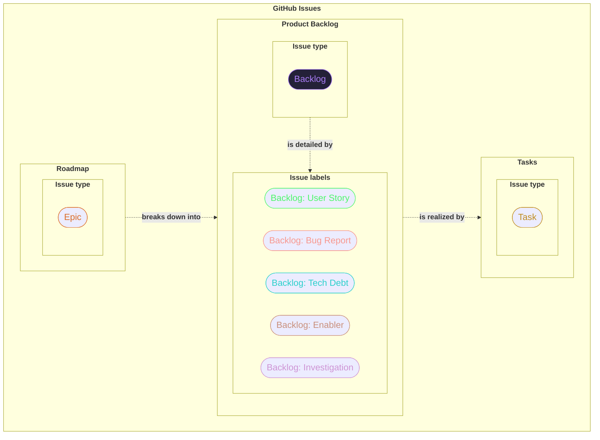

# we-have-tiktok-at-home

This repository and accompanying GitHub Projects demonstrate an approach to working with epics, backlog, and tasks for a TikTok-like product.

## GitHub Organization

The GitHub Organization [inno-swp-2025](https://github.com/inno-swp-2025) was created to use organization-specific features.

## Issues

We created several sample [issues](https://github.com/inno-swp-2025/we-have-tiktok-at-home/issues) in the [inno-swp-2025/we-have-tiktok-at-home](https://github.com/inno-swp-2025) repository.

If you plan to have several repositories in your organization, you can [create default issue labels](https://docs.github.com/en/organizations/managing-organization-settings/managing-default-labels-for-repositories-in-your-organization).

### Issue types

Each issue has a [type](https://docs.github.com/en/issues/tracking-your-work-with-issues/configuring-issues/managing-issue-types-in-an-organization).

Types:

- `Epic` - a large user story.
- `Backlog` - a Product Backlog Item (PBI).
- `Task` - a task related to a PBI.

### Issue labels

Additionally, issues have meaningful [labels](https://github.com/inno-swp-2025/we-have-tiktok-at-home/labels).

### Compatibility of issue types and labels

|                | `Epic` | `Backlog` | `Task` |
| -------------- | :----: | :-------: | :----: |
| `Priority: *`  |   ✅   |    ✅     |   ✅   |
| `Meta: *`      |   ✅   |    ✅     |   ✅   |
| `Platform: *`  |   ✅   |    ✅     |   ✅   |
| `Backlog: *`   |   ❌   |    ✅     |   ❌   |
| `Severity: *`  |   ❌   |    ✅     |   ❌   |
| `Scope: *`     |   ❌   |    ❌     |   ✅   |
| `Component: *` |   ❌   |    ❌     |   ✅   |

Legend:

- Columns - issue types.
- Rows - issue labels.
- ✅ - compatible
- ❌ - incompatible

### Tips

- If you specify the `Scope: *`, specify the `Component: *`.

### Issue hierarchy

The following diagram shows connections between issues types and certain labels.

## Default community health files

We store [default community health files](https://docs.github.com/en/communities/setting-up-your-project-for-healthy-contributions/creating-a-default-community-health-file) in the [inno-swp-2025/.github](https://github.com/inno-swp-2025/.github) repository.

These files include [Issue Form](https://docs.github.com/en/communities/using-templates-to-encourage-useful-issues-and-pull-requests/syntax-for-issue-forms) templates.
These templates can be used for creating new issues in all organization repositories.

The following templates are available:

- [Bug report](https://github.com/inno-swp-2025/.github/blob/main/.github/ISSUE_TEMPLATE/bug-report.yml)
- [Task](https://github.com/inno-swp-2025/.github/blob/main/.github/ISSUE_TEMPLATE/task.yml)
- [User Story](https://github.com/inno-swp-2025/.github/blob/main/.github/ISSUE_TEMPLATE/user-story.yml)

## The GitHub Projects

[GitHub Projects](https://docs.github.com/en/issues/planning-and-tracking-with-projects/learning-about-projects/about-projects) let one organize issues, estimate them, and plan work on them.

Projects can be [copied](https://docs.github.com/en/issues/planning-and-tracking-with-projects/creating-projects/copying-an-existing-project) and used as templates.

We provide [own projects](https://github.com/orgs/inno-swp-2025/projects) for each issue type:

- [Roadmap](#project-roadmap)
- [Product Backlog](#project-product-backlog)
- [Tasks](#project-tasks)

## Project `Roadmap`

[Link](https://github.com/orgs/inno-swp-2025/projects/5)

This project shows when the team plans to work on type `Epic` issues and by which milestone they will be completed.

### Limitations

- The `Start` and `Finish` fields must be (manually) synchronized with start and finish dates of related type `Backlog` issues.

### Project settings

#### Custom fields (additional)

- `Start` of type `Date` - (planned) date of starting the work on an issue.
- `Finish` of type `Date` - (planned) date of finishing the work on an issue.

### View `Timeline`

- Layout: `Roadmap`.
- Configuration:
  - Group by: `Milestone`.
  - Markers: `none`.
  - Sort by: `manual`.
  - Dates: `Start and Finish`.
  - Zoom level: `Month`.
  - Field sum: `Count`.
  - Slice by: `none`.
- User settings:
  - [x] Show date fields.
  
## Project `Product Backlog`

[Link](https://github.com/orgs/inno-swp-2025/projects/1)

This project shows the product backlog consisting of type `Backlog` issues.

### Limitations

- The `Iteration` field of a type `Backlog` issue and its type `Task` sub-issue must be (manually) synchronized.

### Project settings

#### Custom fields (additional)

- `Story Points` of type `Number` - estimate of a `Backlog` issue in Story Points.
- `Iteration` of type `Iteration` - iteration that the issue belongs to.
- `Priority` of type `Number` - numeric priority of an issue that equals to the `<number>` in the `Priority: <number>` label of that issue.

### View `Status`

- Provides `Entrance Criteria` in Kanban board column descriptions.
- Shows total `Story Points` per iteration.

#### View options

- Layout: `Board`.

- Configuration:
  - Fields: `Assignees`, `Status`, `Story Points`, `Iteration`, `Sub-issues progress`, `Priority`.
  - Column by: `Status`.
  - Group by: `Iteration`.
  - Sort by: `Iteration` (ascending).
  - Field sum: `Count`, `Story Points`.
  - Slice by: `Priority`.

### View `Timeline`

Shows planned schedule of working on type `Backlog` issues.

#### View options

- Layout: `Roadmap`.

- Configuration:
  - Group by: `Iteration`.
  - Markers: `Iteration`.
  - Sort by: `Iteration` (ascending), `Priority` (ascending).
  - Dates: `Iteration`.
  - Zoom level: `Month`.
  - Field sum: `Count`, `Story Points`.
  - Slice by: `Parent issue`.

## Project `Tasks`

[Link](https://github.com/orgs/inno-swp-2025/projects/2)

This project shows connections between type `Task` issues, their parent type `Backlog` issues, and `Iterations`.

### Limitations

- The `Iteration` field of a type `Task` issue and its parent type `Backlog` issue must be (manually) synchronized.

### Project settings

#### Custom fields (additional)

- `Ideal Hours` of type `Number` - estimated number of ideal hours required to complete the issue.
- `Iteration` of type `Iteration` - iteration that the issue belongs to.
- `Priority` of type `Number` - numeric priority of an issue that equals to the `<number>` in the `Priority: <number>` label of that issue.
- `Start` of type `Date` - (planned) date of starting the work on an issue.
- `Finish` of type `Date` - (planned) date of finishing the work on an issue.

### View `Status`

- Provides `Entrance Criteria` in Kanban board column descriptions.
- Shows total `Ideal Hours` per iteration.

#### Settings

- Layout: `Board`.

- Configuration:
  - Enabled fields: `Assignees`, `Status`, `Iteration`, `Ideal Hours`, `Priority`, `Linked pull requests`.
  - Column by: `Status`.
  - Group by: `Iteration`.
  - Sort by: `Iteration` (ascending), `Priority` (ascending).
  - Field sum: `Count`, `Ideal Hours`.
  - Slice by: `none`.

### View `With Parents`

- For each type `Backlog` issue, shows to which sprint its type `Task` sub-issues were assigned.
- Shows total `Ideal Hours` for an `Iteration`.
- Shows type `Task` issues sorted by priority within each `Iteration`.

#### Settings

- Layout: `Table`.

- View options:
  - Enabled fields: `Iteration`, `Priority`, `Ideal Hours`, `Status`, `Assignees`, `Parent issue`.
  - Group by: `Iteration`.
  - Sort by: `Priority` (ascending), `Ideal Hours` (ascending).
  - Fields sum: `Count`, `Ideal Hours`.
  - Slice by: `Parent issue`.

### View `Timeline`

- Shows type `Task` issues distributed by `Iteration`s on a timeline.
- `Date fields` are set to `Iteration start` and `Iteration end`.
- One can set the `Date fields` to `Start` and `Finish` and adjust them by clicking on the left or on the right side of an issue box on the timeline and dragging it.

#### Settings

- Layout: `Roadmap`

- Configuration:
  - Group by: `Iteration`.
  - Markers: `Iteration`.
  - Sort by: `Iteration` (ascending), `Priority` (ascending).
  - Dates: `Iteration`.
  - Zoom level: `Month`.
  - Field sum: `Count`, `Ideal Hours`.
  - Slice by: `Parent issue`.

- User settings:
  - `Show date fields`
