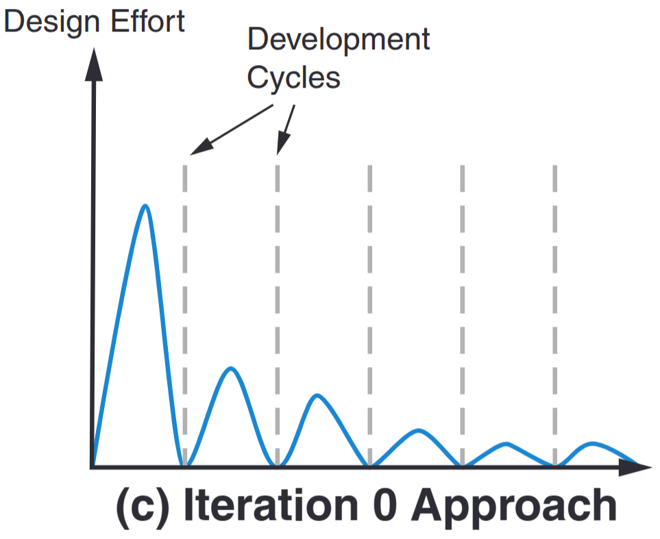
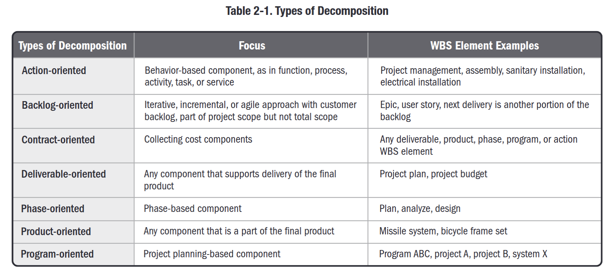
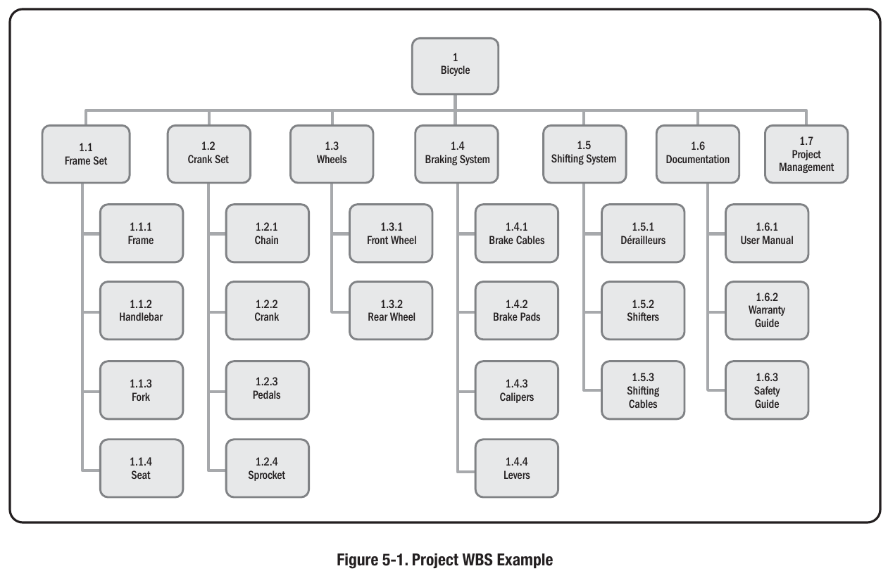
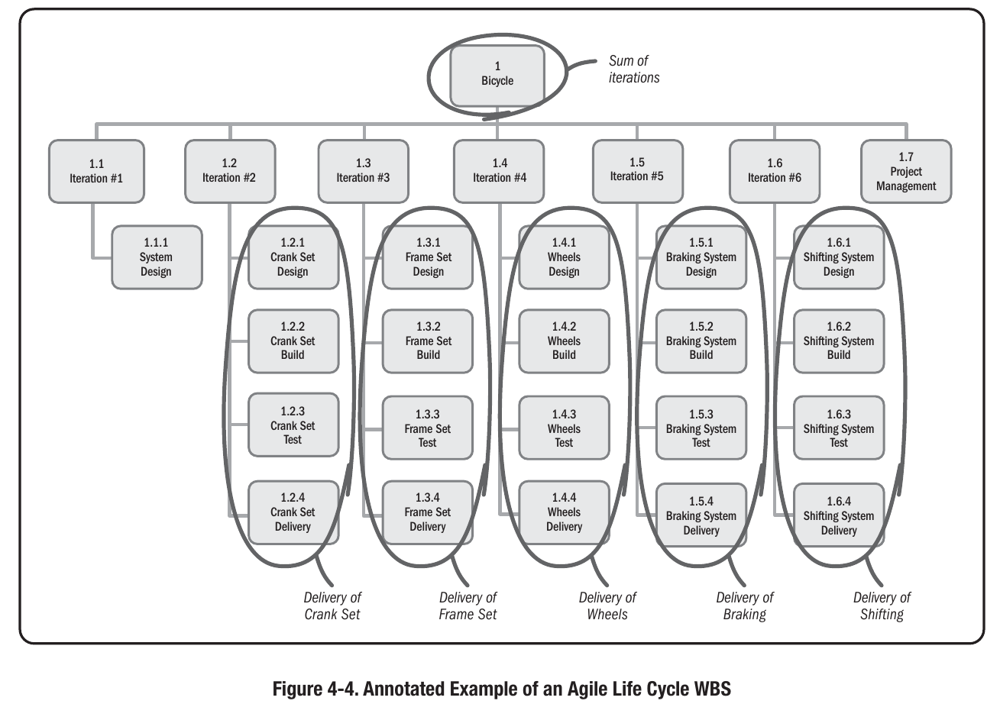
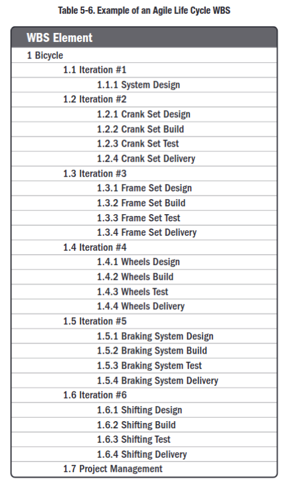
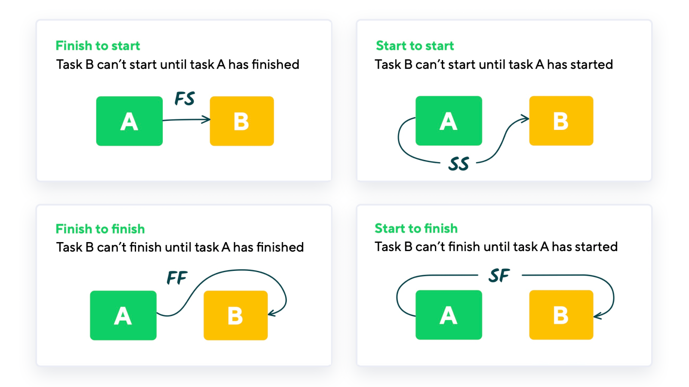
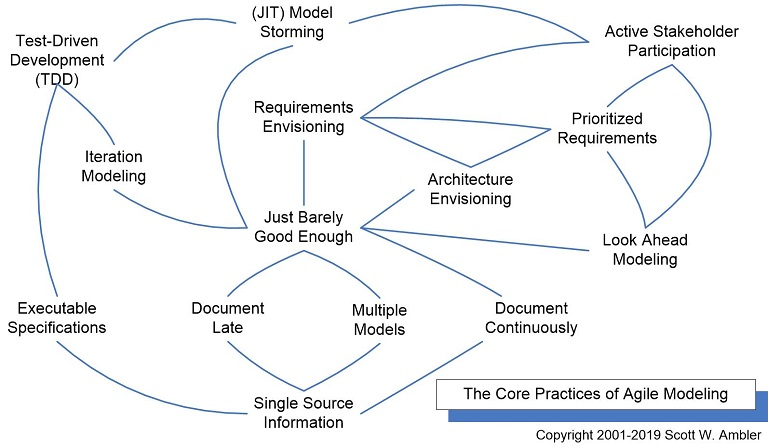
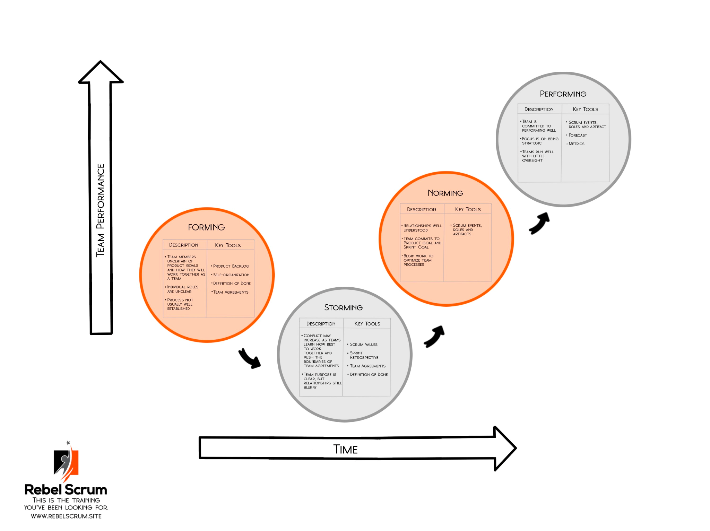
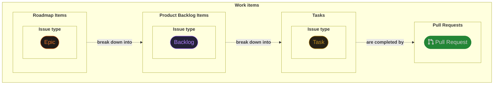

<!-- TOC ignore:true -->
# The Guide

This repository provides a guide for managing the development of a software project as a team using modern software engineering knowledge and tools. The guide should help you pass several Innopolis University courses.

## TL;DR

- Focus on delivering a product that has quality sufficient for [stakeholders](#stakeholders).
- Negotiate with stakeholders the most important [quality attributes](#quality-attributes) and record testable [quality attribute scenarios](#quality-attribute-scenarios).
- Use architecture, processes, tools, and tests that help you achieve the desired quality.
- Make justified decisions about various aspects of your project and record them.
- Regularly:
  - gather and address stakeholders' [feedback](#feedback-loop) on your project.
  - groom your Product Backlog based on the feedback.
  - manage stakeholders' expectations based on the scope (remaining work), human resources, and schedule.

## TL;DR extended

- Identify stakeholders (usually course instructors and customer).
- Capture their high-level functional and non-functional requirements, business goals, constraints.
- Derive architecturally significant requirements (ASRs) in the [Quality Attribute Scenario](#quality-attribute-scenarios) format.
- Design a high-level architecture that satisfies the ASRs.
- For each ASR, explain how exactly you're going to test it (you may need to detail the architecture for this task).
- Based on the architecture, split the work into epics, backlog items, and tasks.
- Plan the work for several sprints using a Scrum board.
- Assign tasks and set deadlines.
- Keep stakeholders informed about your decisions and progress.
- Use architecture, processes, and tools that help you achieve that quality.
- Use git for code and documentation versioning from the first day of the project;
- Use GitHub for collaboratively working on the code;
- Use GitHub issue form templates and pull request (PR) templates for consistent quality of issue and PR descriptions;
- Use a hierarchy of issues, e.g.: epics (don't fit into a single sprint) -> high-level Product Backlog Items (user stories, bug reports, etc. that fit into a sprint) -> tasks.
- Mention issues addressed by a PR in the PR description.
- Use GitHub Projects for:
  - planning work;
  - estimating effort;
  - prioritizing issues;
  - tracking progress.
- Use GitHub Pages for publishing project documentation.
- Use GitHub Issues to assign tasks and reassign if tasks weren't completed timely.
- Use GitHub Actions for CI/CD.
- Use diagrams as code ([Mermaid](https://mermaid.js.org/), PlantUML, LikeC4, [C4](https://c4model.com/), and [others](https://c4model.com/tooling)).
- Embrace LLMs for:
  - analyzing recordings;
  - asking questions about docs;
  - brainstorming architecture;
  - generating diagrams as code;
  - generating task descriptions;
  - generating [acceptance criteria](#acceptance-criteria);
  - fixing language problems in a text;
  - writing personal study plans for the project domain and technologies;
  - scaffolding ([project generation](https://en.wikipedia.org/wiki/Scaffold_(programming)#Project_generation));
  - helping you [learn to code](https://docs.github.com/en/get-started/learning-to-code/setting-up-copilot-for-learning-to-code);
  - etc.
- Beware of LLMs' hallucinations.
- Create a knowledge base to share project context with LLMs, stakeholders, and teammates.
- Store the knowledge base in the `docs` directory of your repo.
- Decide on the file structure that facilitates usage of LLMs.
- As soon as possible:
  - Learn about stakeholders' expectations and requirements so that you have enough time to manage and meet them.
  - Gather and validate with stakeholders [Architecturally Significant Requirements (ASRs)](#architecturally-significant-requirements-asrs).
  - Develop an initial [architecture](#architecture) that will enable you to satisfy ASRs.
  - Communicate your decisions to team members and stakeholders.
- Ensure most of your decisions are justified and recorded.
- Use Scrum, a light-weight agile [software process framework](#software-process-framework).
- Be agile and be ready for changes in requirements and hence in [the architecture](#when-to-design-the-architecture).
- If you need to present your results to stakeholders:
  - try to present your results in a way that:
    - stakeholders expect;
    - is convenient for stakeholders if the expected format isn't specified

  - better show and ask if the format is convenient than assume it is.
  - explicitly explain any discrepancies between your presentation and the expected format.
  
    Example: If the assignment asks to provide a link to your deployed product and you have just binaries, explain what "deployed" means in your case.
- Document usability tests, run them before and during the meeting with the customer, address failing tests and customer's feedback.
- Agree on the convenient meeting time in advance (see the [Timeful](https://timeful.app/) app).
- Don't skip team meetings:
  - Sprint Planning;
  - Sprint Review;
  - meeting with the customer;
  - Sprint Retrospective.
- Discuss architecture during team meetings.
- Integrate parts of your system as soon as possible and often.
- Define protocols for communication between your system parts.

  E.g., if your system has client and server parts, produce OpenAPI3 or protobuf spec and generate (if appropriate tooling is available) types for back end and front end from the spec.
- Read about [challenges and lessons learned](#potential-challenges-and-lessons-learned) in students' team software projects.
- Openly discuss your team work during a Sprint Retrospective. Check your assumptions by asking questions.
- If you have poor communication in the team despite meetings:
  - try team building activities;
  - ask a course instructor to conduct a Sprint Retrospective.
- Record all meetings whenever possible to later:
  - analyze original customer's feedback;
  - convert task discussions into issue descriptions;
  - [deal with free riders](#deal-with-free-riders).
- Discuss tasks and [acceptance criteria](#acceptance-criteria) during team meetings to align task understanding and quality standards of team members.
- Set a clear goal for each sprint and assign all issues planned for the sprint.
- Leave enough buffer time to complete tasks, test code, and prepare neat assignment submissions.
- Make sure people know and understand their tasks for the sprint. Ping them and discuss their tasks at the start of a sprint.
- Track team activity (participation) and dynamics (main points from team meetings) in a [sprint tracking sheet](#sprint-tracking-sheet).
- Decide on rules for writing good [acceptance criteria](#acceptance-criteria).
- Let the person who understands the task write [acceptance criteria](#acceptance-criteria) for that task.
- If there is a risk that a task won't be completed, assign it to two people. One of them should be a reliable and competent person.
- Identify people who struggle with their tasks and help them learn and complete tasks.
- Identify free riders who consistently do some or all of these:
  - miss team meetings;
  - don't complete their tasks timely so that tasks have to be reassigned;
  - produce poor quality work despite clear acceptance criteria.
- Ask course instructors to help [deal with free riders](#deal-with-free-riders).

<!-- TOC ignore:true -->
## Table of contents

<!-- TODO re-generate with huntertran.auto-markdown-toc -->

<details><summary>Click to view</summary>

<!-- TOC -->

- [The Guide](#the-guide)
  - [TL;DR](#tldr)
  - [TL;DR extended](#tldr-extended)
- [Glossary](#glossary)
  - [acceptance criteria](#acceptance-criteria)
  - [assumption](#assumption)
  - [Definition of Done DoD](#definition-of-done-dod)
  - [fact](#fact)
  - [just barely good enough JBGE](#just-barely-good-enough-jbge)
  - [the Pyramid Principle](#the-pyramid-principle)
  - [quality attribute QA](#quality-attribute-qa)
  - [record](#record)
  - [repo](#repo)
  - [SMART](#smart)
  - [stakeholders](#stakeholders)
  - [TA](#ta)
  - [They Ain’t Gonna Read It TAGRI](#they-aint-gonna-read-it-tagri)
  - [validation](#validation)
  - [verification](#verification)
  - [Other terms](#other-terms)
- [Courses](#courses)
  - [Target audience](#target-audience)
  - [Passing the course vs completing the project](#passing-the-course-vs-completing-the-project)
  - [Team goals](#team-goals)
  - [Self-study](#self-study)
  - [Expected learning outcomes](#expected-learning-outcomes)
  - [Grading](#grading)
  - [Surviving a group project](#surviving-a-group-project)
  - [Deal with free riders](#deal-with-free-riders)
    - [Special Retrospective meeting](#special-retrospective-meeting)
  - [Facts vs assumptions](#facts-vs-assumptions)
- [Theory](#theory)
  - [Feedback loop](#feedback-loop)
    - [Use case](#use-case)
    - [Phases](#phases)
      - [Phase 1: Preparation](#phase-1-preparation)
      - [Phase 2: The conversation](#phase-2-the-conversation)
      - [Phase 3: Turn feedback into action](#phase-3-turn-feedback-into-action)
  - [Asking questions](#asking-questions)
  - [Potential challenges and lessons learned](#potential-challenges-and-lessons-learned)
    - [Challenges themes](#challenges-themes)
      - [Sub-themes of Working in a team](#sub-themes-of-working-in-a-team)
      - [Sub-themes of Working in a remote and hybrid setting](#sub-themes-of-working-in-a-remote-and-hybrid-setting)
      - [Sub-themes of Working with an industrial customer](#sub-themes-of-working-with-an-industrial-customer)
      - [Sub-themes of Working with new technology](#sub-themes-of-working-with-new-technology)
      - [Sub-themes of Managing the project](#sub-themes-of-managing-the-project)
      - [Sub-themes of Maintaining self-confidence and motivation](#sub-themes-of-maintaining-self-confidence-and-motivation)
    - [Lessons learned themes](#lessons-learned-themes)
      - [Sub-themes of Working in a team](#sub-themes-of-working-in-a-team)
      - [Sub-themes of Managing the project](#sub-themes-of-managing-the-project)
      - [Sub-themes of Working with an industrial customer](#sub-themes-of-working-with-an-industrial-customer)
      - [Sub-themes of Working in a remote and hybrid setting](#sub-themes-of-working-in-a-remote-and-hybrid-setting)
      - [Sub-themes of Managing the product quality](#sub-themes-of-managing-the-product-quality)
      - [Sub-themes of Setting personal values and code of ethics](#sub-themes-of-setting-personal-values-and-code-of-ethics)
      - [Sub-themes of Formalizing the processes](#sub-themes-of-formalizing-the-processes)
      - [Sub-themes of Working with new technology](#sub-themes-of-working-with-new-technology)
      - [Sub-themes of Taking advice from the mentors](#sub-themes-of-taking-advice-from-the-mentors)
  - [Industrial project](#industrial-project)
    - [Practice areas](#practice-areas)
  - [Software development life cycle SDLC](#software-development-life-cycle-sdlc)
  - [Software process framework](#software-process-framework)
- [Setup](#setup)
  - [Team](#team)
  - [Example project](#example-project)
  - [Telegram](#telegram)
    - [Group](#group)
    - [Meetings](#meetings)
    - [Topics](#topics)
  - [Assignments](#assignments)
    - [Tasks](#tasks)
    - [Planning](#planning)
    - [Review](#review)
    - [Missing deadline](#missing-deadline)
  - [Planning problems](#planning-problems)
  - [Presentation](#presentation)
    - [Presentation slides](#presentation-slides)
      - [Structure](#structure)
      - [Content](#content)
      - [Appearance](#appearance)
      - [Templates](#templates)
    - [Presentation preparation](#presentation-preparation)
    - [Presentation talk](#presentation-talk)
  - [Project management](#project-management)
  - [Set up repositories](#set-up-repositories)
  - [Prepare the knowledge base](#prepare-the-knowledge-base)
    - [Choose a multi-modal LLM service](#choose-a-multi-modal-llm-service)
    - [Collect textual materials](#collect-textual-materials)
    - [Collect video and audio materials](#collect-video-and-audio-materials)
    - [Produce high-quality transcripts](#produce-high-quality-transcripts)
    - [Discuss the knowledge base with the LLM](#discuss-the-knowledge-base-with-the-llm)
    - [Publish the knowledge base](#publish-the-knowledge-base)
  - [Extend the knowledge base](#extend-the-knowledge-base)
  - [Project Charter](#project-charter)
  - [Collect requirements from stakeholders](#collect-requirements-from-stakeholders)
    - [Agree on the meeting format](#agree-on-the-meeting-format)
    - [Prepare questions](#prepare-questions)
    - [Conduct an interview](#conduct-an-interview)
    - [Write requirements as user stories](#write-requirements-as-user-stories)
    - [Analyze the interview](#analyze-the-interview)
  - [Architecture](#architecture)
    - [When to design the architecture?](#when-to-design-the-architecture)
    - [Derive architectural decisions using an LLM](#derive-architectural-decisions-using-an-llm)
    - [Why document architecture?](#why-document-architecture)
    - [How to document architecture?](#how-to-document-architecture)
    - [Architecturally Significant Requirements ASRs](#architecturally-significant-requirements-asrs)
    - [Design architecture](#design-architecture)
      - [Architectural decision](#architectural-decision)
      - [Architectural decision records ADRs](#architectural-decision-records-adrs)
    - [Describe tests for ASR scenarios](#describe-tests-for-asr-scenarios)
    - [Build a prototype](#build-a-prototype)
  - [Work breakdown structure WBS](#work-breakdown-structure-wbs)
  - [Critical path method (CPM)](#critical-path-method-cpm)
  - [Break down the work](#break-down-the-work)
  - [Execution](#execution)
  - [The GQM approach](#the-gqm-approach)
  - [The PDSA cycle](#the-pdsa-cycle)
    - [PDSA Theory](#pdsa-theory)
    - [Application](#application)
    - [The PDSA cycle and the Model for Improvement](#the-pdsa-cycle-and-the-model-for-improvement)
    - [Steps](#steps)
    - [Example](#example)
      - [The Three Questions Model for Improvement](#the-three-questions-model-for-improvement)
      - [The Test Cycle PDSA](#the-test-cycle-pdsa)
    - [Alternative approaches](#alternative-approaches)
  - [Quality attributes](#quality-attributes)
    - [Quality attribute scenarios](#quality-attribute-scenarios)
  - [Quality assurance](#quality-assurance)
    - [Formal methods](#formal-methods)
    - [Testing](#testing)
    - [Debugging](#debugging)
    - [CI](#ci)
    - [Automation](#automation)
  - [Documentation](#documentation)
  - [Development tools](#development-tools)
  - [Development environment as code](#development-environment-as-code)
    - [VS Code](#vs-code)
      - [Recommended tools](#recommended-tools)
      - [Recommended extensions](#recommended-extensions)
      - [Recommended VS Code settings](#recommended-vs-code-settings)
      - [Agents](#agents)
    - [Markdown](#markdown)
      - [Recommended VS Code extensions](#recommended-vs-code-extensions)
    - [Drawing](#drawing)
      - [Recommended tools and VS Code Extensions](#recommended-tools-and-vs-code-extensions)
    - [Diagrams as code](#diagrams-as-code)
      - [Recommended tools and VS Code extensions](#recommended-tools-and-vs-code-extensions)
      - [Tools for visualizing architecture](#tools-for-visualizing-architecture)
    - [Direnv](#direnv)
      - [Recommended VS Code extensions](#recommended-vs-code-extensions)
    - [Nix](#nix)
      - [Recommended tools](#recommended-tools)
      - [Recommended VS Code extension](#recommended-vs-code-extension)
      - [Resources](#resources)
      - [NixOS](#nixos)
      - [Telegram chats](#telegram-chats)
      - [Nix flakes](#nix-flakes)
      - [Nix-based devshells](#nix-based-devshells)
      - [GitHub Actions](#github-actions)
      - [Nix alternatives](#nix-alternatives)
    - [Python](#python)
      - [Recommended tools](#recommended-tools)
      - [Recommended VS Code extensions](#recommended-vs-code-extensions)
    - [TypeScript](#typescript)
      - [Recommended tools](#recommended-tools)
    - [Rust](#rust)
      - [Recommended tools](#recommended-tools)
      - [Recommended extensions](#recommended-extensions)
      - [Recommended configuration](#recommended-configuration)
    - [LaTeX](#latex)
      - [Recommended tools](#recommended-tools)
      - [Recommended VS Code extensions](#recommended-vs-code-extensions)
      - [Recommended VS Code settings](#recommended-vs-code-settings)
    - [Bash](#bash)
      - [Recommended VS Code extensions](#recommended-vs-code-extensions)
    - [Extensions and tools for formal languages](#extensions-and-tools-for-formal-languages)
    - [Containers](#containers)
    - [Virtualization](#virtualization)
    - [Secrets](#secrets)
  - [Agile](#agile)
    - [Agile and architecture](#agile-and-architecture)
  - [Agile Model Driven Development AMDD](#agile-model-driven-development-amdd)
  - [Scrum](#scrum)
    - [Scrum theory](#scrum-theory)
    - [Process](#process)
    - [Relation to PDSA](#relation-to-pdsa)
    - [Core roles](#core-roles)
    - [Non-core roles](#non-core-roles)
    - [Tuckman model](#tuckman-model)
    - [Conflict resolution](#conflict-resolution)
      - [Team lead](#team-lead)
    - [Events](#events)
    - [Artifacts and commitments](#artifacts-and-commitments)
    - [Product goal](#product-goal)
    - [Sprints](#sprints)
    - [Sprint goal](#sprint-goal)
    - [Scrum boards](#scrum-boards)
    - [Sprint tracking sheet](#sprint-tracking-sheet)
    - [Meetings](#meetings)
      - [Daily Scrum](#daily-scrum)
      - [Sprint Planning](#sprint-planning)
      - [Sprint Review](#sprint-review)
      - [Retrospective](#retrospective)
      - [Meetings with mentor](#meetings-with-mentor)
    - [Tasks](#tasks)
    - [Free riders](#free-riders)
  - [Processes](#processes)
  - [Work item hierarchy](#work-item-hierarchy)
  - [Issues](#issues)
    - [Sample issues](#sample-issues)
    - [Issue types](#issue-types)
      - [Epic](#epic)
      - [Backlog](#backlog)
      - [Task](#task)
    - [Issue labels](#issue-labels)
    - [Compatibility of issue types and labels](#compatibility-of-issue-types-and-labels)
    - [Issue priority](#issue-priority)
  - [Pull requests](#pull-requests)
  - [Templates](#templates)
    - [Issue form templates](#issue-form-templates)
    - [Pull request templates](#pull-request-templates)
  - [Milestones](#milestones)
  - [Projects](#projects)
  - [Project Roadmap](#project-roadmap)
    - [Limitations](#limitations)
    - [Project settings](#project-settings)
      - [Custom fields additional](#custom-fields-additional)
    - [View Timeline](#view-timeline)
      - [View options](#view-options)
    - [View Kanban](#view-kanban)
      - [View options](#view-options)
      - [Columns](#columns)
        - [To Do](#to-do)
        - [In Progress](#in-progress)
        - [In Review](#in-review)
        - [Done](#done)
  - [Project Product Backlog](#project-product-backlog)
    - [Limitations](#limitations)
    - [Project settings](#project-settings)
      - [Custom fields additional](#custom-fields-additional)
    - [View Kanban](#view-kanban)
      - [View options](#view-options)
      - [Columns](#columns)
        - [To Do](#to-do)
        - [In Progress](#in-progress)
        - [Ready To Deploy](#ready-to-deploy)
        - [Done](#done)
    - [View Timeline](#view-timeline)
      - [View options](#view-options)
  - [Project Tasks](#project-tasks)
    - [Limitations](#limitations)
    - [Project settings](#project-settings)
      - [Custom fields additional](#custom-fields-additional)
    - [View Kanban](#view-kanban)
      - [Settings](#settings)
      - [Columns](#columns)
        - [To Do](#to-do)
        - [In Progress](#in-progress)
        - [Ready For Review](#ready-for-review)
        - [Ready to Merge](#ready-to-merge)
        - [Done](#done)
    - [View With Parents](#view-with-parents)
      - [Settings](#settings)
    - [View Timeline](#view-timeline)
      - [Settings](#settings)
  - [Shadow libraries](#shadow-libraries)
  - [Local library](#local-library)
  - [Browser extensions](#browser-extensions)
    - [Firefox](#firefox)
    - [Chrome](#chrome)
  - [References](#references)

<!-- /TOC -->
</details>

# Glossary

## acceptance criteria

Conditions for team or stakeholder acceptance, ensuring that the work meets the required standards and setting clear expectations for what needs to be delivered [^HowToUseAcceptanceCriteria].

## assumption

*noun*

Something that you accept as true without question or proof [[Cambridge Dictionary](https://dictionary.cambridge.org/dictionary/english/assumption)].

## Definition of Done (DoD)

*noun*

A formal description of the state of the Increment when it meets the quality measures required for the product. The moment a Product Backlog Item meets the Definition of Done, an Increment is born. The Definition of Done creates transparency by providing everyone a shared understanding of what work was completed as part of the Increment. If a Product Backlog Item does not meet the Definition of Done, it cannot be released or even presented at the Sprint Review [^GlossaryOfScrumTerms].

## fact

*noun*

Something that is known to have happened or to exist, especially something for which proof exists, or about which there is information [[Cambridge Dictionary](https://dictionary.cambridge.org/dictionary/english/fact)].

## just barely good enough (JBGE)

*adjective*

A JBGE artifact is an artifact that at the moment has sufficient quality for a target audience. To make JBGE artifacts, you should know the audience of these artifacts and what quality of these artifacts it expects. As time goes, you may need to change artifacts to keep them JBGE. [^JustBarelyGoodEnough]

See also [TAGRI](#they-aint-gonna-read-it-tagri).

## the Pyramid Principle

*noun*

A tool to give your (written) communication more clarity and efficiency. Lead with the conclusion, then provide key arguments and finally support them with detailed information [^MintoPyramid].

## quality attribute (QA)

*noun*

A measurable or testable property of a system that is used to indicate how well the system satisfies the needs of its stakeholders beyond the basic function of the system [^Bck].

## record

*verb*

To keep information for the future, by writing it down or storing it on a computer [[Cambridge Dictionary](https://dictionary.cambridge.org/dictionary/english/record)].

*noun*

A piece of information or a description of an event that is written on paper or stored on a computer [[Cambridge Dictionary](https://dictionary.cambridge.org/dictionary/english/record)].

## relative estimating

*noun*

Relative estimating is used to create estimates that are derived from performing a comparison against a similar body of work, taking effort, complexity, and uncertainty into consideration. Relative estimating is not necessarily based on absolute units of cost or time. [Story points](#story-points) are a common unitless measure used in relative estimating. [[^Pmbok], p. 178]

## repo

*noun*

A Git repository [[What are code repositories?](https://github.com/resources/articles/software-development/what-are-code-repositories)].

See also [[About repositories](https://docs.github.com/en/repositories/creating-and-managing-repositories/about-repositories)].

## SMART

*adjective*

A framework for setting management objectives, emphasizing the importance of clear goals [^SmartCriteriaWiki].

Acronym components [^SmartCriteriaWiki]:

- **S**pecific: Targeting a particular area for improvement.
- **M**easurable: Quantifying, or at least suggesting, an indicator of progress.
- **A**ssignable: Defining responsibility clearly.
- **R**ealistic: Outlining attainable results with available resources.
- **T**ime-related: Including a timeline for expected results.

## stakeholders

*noun*

All individuals and groups affected by the Scrum project, both within and outside the organization (e.g., all [core](#core-roles) and [non-core](#non-core-roles) roles, vendors, internal groups, experts, and so on) [^SbokGuide].

In your course, stakeholders are usually:

- course instructors;
- your customer;
- users of your product.

## story points

*noun*

A unit used to estimate the relative level of effort needed to implement a user story [[^Pmbok], p. 250].

Story points are a common unitless measure used in [relative estimating](#relative-estimating) [[^Pmbok], p. 178].

## sprint velocity

*noun*

Sprint Velocity is the rate at which the team can complete the work in a Sprint. It is usually expressed in the same units as those used for estimation, normally [story points](#story-points) or ideal time. A record of the team’s velocity for each Sprint is maintained and used as a reference point for future Sprints. The previous Sprint Velocity becomes the most important factor in determining the amount of work the team can commit to in a subsequent Sprint. Any changes in the situation or conditions since the last Sprint are accounted for to ensure a better estimation of the Sprint Velocity for the upcoming Sprint. [[^SbokGuide], Sec. 9.3.1.4, p. 219]

## TA

*noun*

Teaching assistant.

## They Ain’t Gonna Read It (TAGRI)

*principle*

The basic idea is that very little of the documentation which gets created during software development actually gets read by the actual target audience. Recognizing this, you should model/document with a purpose and create agile documentation which reflects the true needs of the audience for that documentation. [^Tagri]

See also [JBGE](#just-barely-good-enough-jbge).

## validation

*noun*

The process of providing evidence that a deliverable meets the needs of the user [^ApmGlossary].

## verification

*noun*

Proof of compliance with specified requirements. Verification may be determined by test, analysis, inspection or demonstration [^ApmGlossary].

## Other terms

- [[Agile Glossary](https://agilealliance.org/agile101/agile-glossary/)]

# Courses

This chapter explains what you should know about University courses covered by this guide.

## Target audience

The target audience of this guide are BS and MS students of the Innopolis University atteding the courses:

- ***SWP*** (Software Project) - BS, 1st year, Summer semester;
- ***ITPD*** (IT Product Development) - MS, 1st year, Fall semester;
- ***Industrial Project*** - MS, 1st year, Spring and Summer semesters.

In each course, students are distributed into teams of 4-6 people. Each team develops a project for a customer from the University or an outside company.

Most points in this guide apply to all courses.

## Passing the course vs completing the project

- The [Setup](#setup) chapter of this guide explains how to create a working environment that can help you complete your project successfully.
- However, to pass the course, you need to meet requirements and expectations of key project [stakeholders](#stakeholders), not just complete the project.
- Identify key project stakeholders and learn about stakeholders' requirements and expectations as soon as possible. You need to have enough time to manage and meet their requirements and expectations.
- You should communicate to the stakeholders how you met their requirements and expectations in a way that the stakeholders expect.
- You should explicitly explain discrepancies between your deliverables and stakeholders' requirements and expectations.

## Team goals

You should agree with your teammates on:

- the desired course grade;
- threshold of success [^ThresholdOfSuccess] - a minimal set of SMART goals that should all be achieved to consider the project a success.


## Expected learning outcomes

During the course, you should learn to:

- manage your project to achieve project goals;
- make, communicate to stakeholders and teammates, and follow justified (with respect to project goals) decisions about your [SDLC](#software-development-life-cycle-sdlc), processes, architecture etc.;
- demonstrate stakeholders that you have enough control over various [practice areas](#practice-areas) in your project.

## Grading

- Grading is usually subjective.
- You won't know the complete grading scheme because it's assumed that if you know the complete grading scheme:
  - you may produce less creative work;
    - Assumption: [***Goodhart's law***](https://en.wikipedia.org/wiki/Goodhart's_law) holds.
  - you may pay less attention to important parts of an assignment that have small weight in the grade.
    - Assumptions:
      - You're going to balance required effort/time and grade.
      - If you don't know the scheme, you'll treat all parts of an assignment as almost equally important.
- Learn in advance the conditions of individual grading.
- Don't demand individual grading when you experience [teamwork problems](#potential-challenges-and-lessons-learned).
  Instead, ask course instructors to help normalize the team work.

## Surviving a group project

- Have stable and friendly communication inside the team:
  - Meet regularly. Find time for meetings using [Timeful](https://timeful.app/) and/or other services.
  - Respond to messages promptly (in 24 hours at most) [^GroupProjectEtiquette].
  - Bring snacks for your team members when you meet offline [^GroupProjectEtiquette].
- Communicate clearly each sprint how much effort you're going to put into the project. You probably have other courses and life.
- If you get stuck with a task, try to get unstuck by clarifying task requirements and talking to LLMs and team members. Tell what you did and where you got stuck and ask them for help.
- Follow tips for group projects: [^GroupProjectEtiquette] [^TipsToStructureAStrongGroupProject] [^GroupWork].
- Follow basic workplace etiquette rules: [^GuideToChatEtiquetteInWorkplace] [^EtiquetteTipsForUsingChatAtWork] [^The14CommandmentsOfTextingEtiquette].
- Skim [potential challenges and lessons learned](#potential-challenges-and-lessons-learned).
- [Deal with free riders](#deal-with-free-riders) with help of course instructors.
- If you feel something goes wrong, write down your observations and discuss the problem with an LLM.

  If you need input from other team members to resolve the problem, discuss the problem during a [Retrospective](#retrospective).
  
  If you can't resolve the problem, ask the course instructors to help [^HowToHelpStudentsResolveTeamConflict].

## Deal with free riders

> [!IMPORTANT]
> Always communicate with teammates professionally to not make the atmosphere in the team toxic.

- Continuously collect hard evidence:
  - Record participation during team meetings in a sheet available to all team members.
  - Update participation records based on processed [meeting recordings](#produce-high-quality-transcripts).
  - Identify tasks that were reassigned.

- Identify people who consistently do some or all of these:
  - don't participate in team meetings;
  - get their tasks reassigned to other people;
  - produce poor quality work despite clear [acceptance criteria](#acceptance-criteria).

- Discuss with these people what prevents them from contributing productively.
  
  People may struggle with disorders [^WhySomeStudentsStruggleWithGroupWork].
  
  Or, they may feel that their input isn't valued by teammates [[^SbokGuide], Sec. 3.9.3.2, p. 74].

- Explain them that you expect them to work without constant guidance from their teammates.
  
  They should:
  - communicate with others to clarify task requirements and [acceptance criteria](#acceptance-criteria);
  - study necessary materials to complete their tasks (see [Self-study](#self-study)).

- Discuss goals of these people. Determine whether they want to:
  - contribute productively for the project to succeed;
  - contribute just enough to pass the course and not make their teammates annoyed about them;
  - not contribute and fail the course.

- Based on your [team goals](#team-goals) and goals of these people:
  - if they're going to contribute, agree with them on:
    - their role in the project;
    - the sufficient amount of work that they should perform;
    - the amount of guidance that you'll provide to these people so that they become productive enough contributors;
  - otherwise, agree with them that:
    - they're not going to get any task;
    - you'll report no contribution from them until the end of the course;
    - you'll report to the course instructors that they want to fail the course.

- Record your agreement in a format that won't let these people accuse you of making them fail the course.

  For example, write their new roles and responsibilities in the [Project Charter](#project-charter).

## Feedback loop

A feedback loop helps you continually improve [^ContinualImprovementProcess] an artifact or process to achieve specific goals based on evaluation of (changes to) your artifact or process using specific metrics (connected to the goals).

See also [the GQM method](#the-gqm-approach), [the PDSA cycle](#the-pdsa-cycle).

### Use case

You can use a feedback loop to get and process feedback:

- on your progress with assignment tasks from your TA (e.g., during a lab);
- on your product from your customer (e.g., during a Sprint Review);
- on your deliverables for an assignment from your TA or mentor (e.g., during office hours).

### Phases

> [!NOTE]
> This section was generated by Gemini 2.5 Pro and revised by at least one author.

> [!NOTE]
> **What to do** parts should be adapted to your situation.

#### Phase 1: Preparation

Good preparation helps you get the most out of the feedback session.

1. **Define your goal**
    - **What to do:** Know *why* you need feedback. Are you checking a new idea, looking for usability problems, or asking about a technical decision? Clearly state what you want feedback on. Also, mention what is *not* ready for feedback (what is out of scope).
    - **Why it helps:** This focuses the conversation and respects the other person's time. It also prevents discussion about parts of the project you are not ready to show.

2. **Show your work and give context**
    - **What to do:** Present the thing you want feedback on, for example, a user story, a design, some code, or a live demo. Briefly explain the background. For a customer, you could remind them of the sprint goal. For a TA, you could state the requirements of the lab task.
    - **Why it helps:** To give good feedback, people need to see what you are talking about. The context helps them use the right criteria to evaluate your work.

3. **Show what you did with previous feedback**
    - **What to do:** If you have received feedback before, briefly show how you used their last suggestions. For example: "Last time, you said the login was slow. We have now improved it. Here is the new speed."
    - **Why it helps:** This shows that you listen and value their opinion. It builds trust and makes them more willing to help you in the future.

#### Phase 2: The conversation

During the conversation, your goal is to get clear, honest, and detailed feedback.

4. **Ask open-ended questions**
    - **What to do:** Avoid "yes/no" questions or questions that suggest an answer.
        - Instead of: "Is this easy to use?"
        - Ask: "Could you show me how you would use this to complete [a specific task]?"
        - Instead of: "What do you think?"
        - Ask: "What is your first impression of this feature?" or "Was there any point where you felt confused?"
    - **Why it helps:** This encourages people to explain the "why" behind their opinions. You will get much better information than a simple "yes" or "no."

5. **Listen to understand**
    - **What to do:** Your main goal is to listen and learn. Take good notes. Notice if they seem confused or hesitate. Do not argue or defend your work. If you have to explain how something is *supposed* to work, it often means the design is not clear enough.
    - **Why it helps:** If you act defensively, people will stop giving honest feedback. By listening quietly, you can understand their true experience.

6. **Confirm your understanding**
    - **What to do:** When they finish speaking, repeat their main points in your own words. This makes sure you understood them correctly. For example: "So, if I understand correctly, the main problem is that you expected the message to be at the top of the screen, not the bottom. Is that right?"
    - **Why it helps:** This prevents confusion and shows that you were listening. It helps you make sure you are solving the right problem.

#### Phase 3: Turn feedback into action

Good feedback should lead to improvements. Here is how to make that happen.

7. **Analyze and prioritize feedback**
    - **What to do:** After the session, review your notes with your team. Group similar comments together to find the main problems or themes. Decide what to do first. Think about the effort needed for each change versus the benefit it gives. Not all feedback must be implemented.
    - **Why it helps:** This helps your team focus on the most important changes first.

8. **Create clear, actionable tasks**
    - **What to do:** Turn the feedback you decided to work on into specific tasks or user stories in your backlog. Every task needs clear [acceptance criteria](#acceptance-criteria) to show when it is "done."
        - *Example:* "As a user, I want the confirmation button to be green and in the top-right corner so it is more visible."
        - *Acceptance Criteria:* 1. Button color is #28a745. 2. Button is in the top-right of the modal. 3. Clicking the button closes the modal.
    - **Why it helps:** This turns general comments into clear work that you can track in your scrum process.

9. **Implement and close the loop**
    - **What to do:** Implement the changes. After you implement and test the changes, show the person who gave the feedback what you did. You can do this at the next Sprint Review or lab session.
    - **Why it helps:** This improves the product, which is the main goal. It also shows the person that their feedback was valuable, which completes the loop.

## Asking questions

- Before asking a question, search for an answer in relevant sources.

  E.g., for questions about the course these are the official course chat history and course materials.
- Ask question where it can be answered authoritatively.
  
  E.g., ask course instructors to answer questions about the course.
- If multiple people may want to know an answer to a question, let them know both the question and answer(s).

  E.g., ask questions about the course in the official course chat so that both questions and answers are visible to everyone.
- Ask one question per message [^WritingBetterEmailsAndTexts]. A reply to that message will clearly be related to that question.
- If an answer isn't acceptable, reply to it if necessary and ask clarifying questions. Define your own acceptance criteria for answers.
- If you found an acceptable answer to your own question, share that answer.
- Mark messages that contain acceptable answers with a reaction (e.g, "👍" or "👌") to make such answers more noticeable for those looking for them (like on StackOverflow [^SomeoneAnswers]).

## Potential challenges and lessons learned

This section is based on the study *Software engineering team project courses with industrial customers: Students’ insights on challenges and lessons learned* [^SETeamProjectProblems].

Researchers identified various [challenges](#challenges-themes) and [lessons learned](#lessons-learned-themes) from students' reports.

Courses attended by the [target audience](#target-audience) of this guide are similar to the courses covered by the study. Therefore, [lessons learned](#lessons-learned-themes) may be useful.

### Challenges (themes)

[Sec 5](https://www.sciencedirect.com/science/article/pii/S0164121225001098#tbl7)

- Working in a team
- Working in a remote and hybrid setting
- Working with an industrial customer
- Working with new technology
- Managing the project
- Maintaining self-confidence and motivation

#### Sub-themes of *Working in a team*

[Sec 5.1](https://www.sciencedirect.com/science/article/pii/S0164121225001098#sec5.sec5.1)

- Communication issues within team
- Contribution issues within team
- Forming a team with unfamiliar people
- Managing changes within team
- Poor team dynamics
- Coordination issues within team
- Developing the team mindset
- Managing conflicts within team
- Keeping track of team progress
- Skill gap between team members
- Different ambition levels within team
- Adapting to diverse working styles
- Other difficulties working in a team
- No prior experience working in a team

#### Sub-themes of *Working in a remote and hybrid setting*

[Sec 5.2](https://www.sciencedirect.com/science/article/pii/S0164121225001098#sec5.2)

- Communicating with the team remotely
- Fostering team dynamics in remote setting
- Staying motivated while working remotely
- Tracking team progress in remote setting
- Maintaining team efficiency in remote setting
- Inability to work in customer premises
- Adapting to online working mode
- Keeping focus while working from home
- Managing sickness
- Maintaining work-life balance
- Working on-site during the pandemic
- Maintaining wellbeing

#### Sub-themes of *Working with an industrial customer*

[Sec 5.3](https://www.sciencedirect.com/science/article/pii/S0164121225001098#sec5.3)

- Understanding requirements
- Managing technical complexity in the project
- Managing the project scope
- Understanding customer’s system
- Working in the customer technical environment
- Communicating with the customer
- Integrating different parts of the project
- Lack of experience in project domain
- High expectations of the customer
- Working on outdated parts of the system

#### Sub-themes of *Working with new technology*

[Sec 5.4](https://www.sciencedirect.com/science/article/pii/S0164121225001098#sec5.4)

- Lack of experience with tools & technology
- Lack of support in chosen technologies
- Making appropriate technology choices
- Lack of experience with version control SW
- Equipment-related challenges

#### Sub-themes of *Managing the project*

[Sec 5.5](https://www.sciencedirect.com/science/article/pii/S0164121225001098#sec5.5)

- Making correct effort estimates
- Making initial plans
- Lack of clear work distribution
- Lack of initiative to take project management roles
- Lack of project management experience
- Even distribution of tasks
- Ineffective time management

#### Sub-themes of *Maintaining self-confidence and motivation*

[Sec 5.6](https://www.sciencedirect.com/science/article/pii/S0164121225001098#sec5.6)

- Doubts in ability to achieve project goals
- Difficulty staying motivated

### Lessons learned (themes)

[Sec 6](https://www.sciencedirect.com/science/article/pii/S0164121225001098#sec5)

- Working in a team
- Managing the project
- Working with an industrial customer
- Working in a remote and hybrid setting
- Managing the product quality
- Setting personal values and ethics
- Formalizing the processes
- Working with new technology
- Taking advice from the mentors

#### Sub-themes of *Working in a team*

[Sec 6.1](https://www.sciencedirect.com/science/article/pii/S0164121225001098#sec6.1)

- Ensure good team communication
- Create a conducive team environment
- Create good team dynamics
- Manage team meetings effectively
- Develop a team mindset
- Share knowledge within team
- Create sub-groups in large teams
- Appoint a team leader
- Ensure good coordination within team
- Set clear goals for the team
- Encourage reflection and feedback
- Define a code of conduct for the team

#### Sub-themes of *Managing the project*

[Sec 6.2](https://www.sciencedirect.com/science/article/pii/S0164121225001098#sec6.2)

- Invest time in planning
- Manage work distribution effectively
- Manage requirements & changes efficiently
- Invest time in effort estimation
- Make informed choices for the project
- Focus more on risk management
- Use project management tools effectively

#### Sub-themes of *Working with an industrial customer*

[Sec 6.3](https://www.sciencedirect.com/science/article/pii/S0164121225001098#sec6.3)

- Communicate effectively with the customer
- Understand requirements from customers' perspective
- Conduct effective meetings with customer
- Keep commitments with customer
- Optimize learning in customer environment

#### Sub-themes of *Working in a remote and hybrid setting*

[Sec 6.4](https://www.sciencedirect.com/science/article/pii/S0164121225001098#sec6.4)

- Make good use of collaboration tools for remote work
- Working on-site is better
- Working remotely is better
- Setup team schedule for remote work
- Use camera in online meetings

#### Sub-themes of *Managing the product quality*

[Sec 6.5](https://www.sciencedirect.com/science/article/pii/S0164121225001098#sec6.5)

- Focus more on testing
- Focus more on code quality
- Focus more on design and architecture
- Take into account product usability

#### Sub-themes of *Setting personal values and code of ethics*

[Sec 6.6](https://www.sciencedirect.com/science/article/pii/S0164121225001098#sec6.6)

- Try new technologies without hesitation
- Have confidence and a positive attitude
- Maintain self discipline
- Be respectful to others
- Voice your opinion
- Have breaks from work to refresh
- Ask questions and take initiatives
- Keep record of time spent
- Keep your commitments
- React early if subjected to bullying
- Be proactive to solve problems
- Identify your own skillset

#### Sub-themes of *Formalizing the processes*

[Sec 6.7](https://www.sciencedirect.com/science/article/pii/S0164121225001098#sec6.7)

- Follow agile practices
- Document the project and the process
- Maintain shared repository of documents

#### Sub-themes of *Working with new technology*

[Sec 6.8](https://www.sciencedirect.com/science/article/pii/S0164121225001098#sec6.8)

- Invest time in learning new technologies
- Make good use of version control system
- Learn one new technology at a time

#### Sub-themes of *Taking advice from the mentors*

[Sec 6.9](https://www.sciencedirect.com/science/article/pii/S0164121225001098#sec6.9)

- Take advice from the mentors

## Industrial project

### Practice areas

Teams have an obligation to demonstrate they are controlling and managing their project in a discipline way with respect to the following 7 practice areas. Teams may emphasize different practices during different semesters based on the product development lifecycle and program course scheduling. The 7 practice areas are explained below:

A. Project Planning: Teams are able to show that they have created and are using strategic plans and tactical plans based on some repeatable estimation technique. Strategic plans should include realistic milestones. Tactical (short term) plans and are derived from and correlated with strategic plans.

B. Project Tracking: Teams are able to demonstrate that they are tracking their team’s progress with respect to their plans and regularly monitor their progress and make changes to the plans as necessary. Teams review progress with their mentors and their customers. Teams collect and have available basic progress measurement metrics.

C. Context and Requirements Engineering: Teams establish the project and business context. Teams identify the key stakeholders and establish communication mechanisms to maintain interaction with their customers. Teams develop plans to regularly meet with their customers to elicit requirements. Changes to requirements and impacts to plans are negotiated with the customer.

D. Quality Management: Teams are able to show that they have established quality mechanisms consistent with the needs of their client. Quality mechanisms may include prevention mechanisms as well as detection mechanisms. Teams will collect and have available basic quality plans and metrics consistent with the phase of the project.

E. Configuration Management: Teams can show that they have policies, processes, and tools for managing the configuration of the project artifacts to include at a minimum: requirements, design, meeting minutes, code, test plans, project plans, and other similar artifacts (teams will provide an archive or access to their archive of all project artifacts).

F. Architecture Design: Team plans include architecture design activities. Architectural designs form the basis of detailed designs and guide construction. Teams evaluate the design for fitness of purpose. Teams will document the design according to best design documentation practices. Teams must be able to demonstrate that they are following and using the established design.

G. Risk Management: Teams perform basic project risk management to include: risk identification, assessment of probability, impact, priority, and mitigation strategies. Plans will include risk management activities.

These practice areas list those practices that each team should fulfill, but not how they should fulfill them. Teams are free to satisfy these practice areas in any way that best meets the needs of their team, project, and their customer. Teams should be able to justify their approach and reason about alternatives.

## Software development life cycle (SDLC)

The life cycle for any software system contains a number of concrete stages relevant to stakeholders [^Swebok]. These concrete stages fit into the following general stages (not necessarily sequential):

- **Concept**: At this stage, stakeholders' needs are identified, concepts will be explored, and solutions will be proposed.
- **Development**: At this stage, requirements representing the users' needs will be refined, solutions will be created, systems built, and all undergo the needed verification and validation processes.
- **Production**: This stage will have a different scope depending on the characteristics of the software system under focus. Generally speaking, it will include the production and testing of the system.
- **Utilization**: At this stage, the system operates to satisfy users' needs.
- **Support**: At this stage, developers provide the required actions to achieve a satisfactory operation.
- **Retirement**: At this stage, the team follows established procedures to dispose of the system.


## Telegram

### Group

Create a Telegram group for team members.

You may add your mentor or a TA there if you need supervision and they don't mind.

Discuss the project only in the group and not in personal messages so that:

- you don't need to send everyone the same message, e.g., with a meeting link;
- group members can see all discussions and can join them freely;
- you can search in all project-related discussions by searching in the group or exported history.


### Topics

Create topics in the group to have focused streams of messages in each topic.

Suggested topics:

- `Important` - for important information such as:
  - team member names;
  - Telegram and GitHub usernames;
  - roles (see [Roles](#roles));
  - rights and responsibilities of the project manager (can also be documented in the [Project Charter](#project-charter));
  - links to the:
    - repository;
    - the most important boards on GitHub Projects;
    - CONTRIBUTING.md;
    - docs;
    - deployed product;
    - Google Drive;
    - etc.
- `Recordings` - for storing video and audio recordings.
  
  You may want to create a backup of recordings in another group because they're evidence for [dealing with free riders](#deal-with-free-riders).
- `Pull requests` - for pinging people about pull requests, e.g., when asking for a review.
- `Tasks` - for pinging people about tasks, e.g., when assigning a task or asking about the task status.
- `Assignments` - for discussing assignments, presentations, etc.
- `General` - for all other discussions.

## Presentation

When you design a presentation, think about:

- Which goals do you want achieve through this presentation?
  - Example of a goal: You want to reassure your stakeholders that everything in the project is under your control and goes as planned.
- What are key takeaways (what your audience should remember) aligned with your goals?
  - Example of a takeaway: "LLMs quickly and accurately mapped our architecture description to actionable tasks."
- What does the audience expect to see and hear during the presentation?
  - Example of expectations: Course instructors asked you to talk about specific topics during presentation.
- How familiar with the topic your audience is?
  - Example of unfamiliarity with a topic: You're going to talk about architecture of your system, but your audience doesn't know what the word "architecture" means, so you have to explain the concept.
- How much time do you have for presenting?
  - Example of a wrong slide count: You created 60 slides for a 5-minute presentation.
- How to make navigation over slides convenient for someone who wants to read the slides as a PDF after the presentation?
  - Example of a situation when someone reads the slides afterwards: Course instructors go through your presentation slides to access and grade artifacts that you mentioned.

### Presentation slides

The presentation slides should have nice [structure](#structure), [content](#content), and [appearance](#appearance).

[Acceptance criteria](#acceptance-criteria) in the corresponding sections specify what is "nice".

#### Structure

- The presentation has the following parts:
  - title slide;
  - agenda slide(s);
  - main part;
  - final slide(s);
- If you decided to provide an appendix (backup slides that you're going to open only during the Q&A session [^HandlingAudienceQuestions]), the presentation has the following parts after the final slide(s):
  - appendix outline;
  - appendix slides;
- The title slide:
  - provides correctly capitalized presentation title, presenter name(s), date;
  - doesn't contain uncommon abbreviations that can confuse your audience.
- Agenda slide(s):
  - are provided right after the title slide;
  - display the outline of the main part;
  - display a hyperlink to the appendix outline if the appendix exists;
- Appendix outline displays hyperlinks to appendix slides;

#### Content

- All required topics are covered in the main part in enough detail to achieve your goals.
- The final slide contains key takeaways aligned with your presentation goals [^HowToWriteKeyTakeawaySlides].
- Additional information that you're going to cover very briefly or completely skip is distributed between special slides in the main part and the appendix.

  You may need such special slides for the Q&A session.

#### Appearance

- Special slides are (either of these):
  - visible and marked as such so that during the presentation:
    - the audience learns these slides exists;
    - you can quickly understand during the presentation that the slide is safe to skip.
  - hidden.
- Each slide:
  - has an aspect ratio appropriate for the presentation tool (screen, beamer).

    The 16:9 ratio [^AspectRatio16to9] is very common.
  - has a unique number;
  - has a title;
  - is not overloaded with information;
  - contains no walls of text;
  - is polished;
- Each important text element is readable when slides are displayed by the presentation tool and viewed from particular places in the verue where you're going to present;
- Each diagram and table:
  - is clearly visible;
  - has a meaningful legend;
- Fonts are used consistently;
- All hyperlinks are correct;
- QR codes are accompanied by hyperlinks;
- Citations mention source authors.
  
  It's hard to keep numbers in mind when listening to a presentation. So, use the APA citation style [^ApaCitationStyle] or a similar one and do NOT use the the IEEE style [^IeeeCitationStyle].

1. [Create](https://docs.github.com/en/organizations/collaborating-with-groups-in-organizations/creating-a-new-organization-from-scratch) a GitHub organization.
1. [Import](https://docs.github.com/en/migrations/importing-source-code/using-github-importer/importing-a-repository-with-github-importer) or [transfer](https://docs.github.com/en/repositories/creating-and-managing-repositories/transferring-a-repository) your repositories into your organization.
1. Consider switching to a [monorepo](https://graphite.dev/guides/polyrepo-to-monorepo-migrations-guide).
1. Create issue types similar to ours (see [Issue types](#issue-types)).
1. Create issue labels similar to ours (see [Issue labels](#issue-labels)).
1. Copy our projects (see [Projects](#projects)).
1. Import the [.github](https://github.com/inno-swp-2025/.github) repo into your organization.
1. Update templates in the `.github` repo.
    - In [issue form templates](#issue-form-templates), update:
      - `projects:` - to automatically add issues to your projects;
      - `labels:` - to automatically create issues with your labels.
1. Copy this `README` (that you read now) somewhere into your repo and modify it as necessary.
1. Update all links (e.g., in `Project details` in your projects) to this `README` to point to your version.
1. Adjust entry criteria specified in Kanban boards (see [Kanban boards](#kanban-boards)).

## Prepare the knowledge base

Having a well-structured knowledge base for your project will help you share the information about the project with stakeholders and LLMs.

### Choose a multi-modal LLM service

Examples:

- [Google AI Studio](https://aistudio.google.com)
- [ChatGPT](https://chatgpt.com/)

### Collect textual materials

Collect textual materials and images that provide relevant information about your project, e.g.:

- Description of stakeholders;
- Project description and documentation;
- Diagrams (as code);
- User stories;
- Discussions with the customer on Telegram etc.;
- Competing products and their properties;
- GitHub issues.

### Collect video and audio materials

Collect all video and audio materials relevant to the project, e.g., recordings of:

- Interviews with the customer;
- Usability sessions;
- Sprint Planning and Sprint Review [meetings](#meetings).

### Produce high-quality transcripts

1. (Optional) Remove sensitive information from recordings.
1. For video and audio recordings, get high-quality transcripts with speaker labels and timestamps.
1. (Optional) Convert video recordings to audio recordings.
1. For each recording:
    1. load it together with its transcript into a chat with the LLM.
    1. Ask the LLM to improve transcript text using the recording.
    1. (Optional) Ask the LLM to remove sensitive information.
    1. Check the [diff](https://en.wikipedia.org/wiki/Diff) between the original transcript and improved transcript (e.g. using the [Compare files](https://code.visualstudio.com/docs/editing/codebasics#_compare-files) feature in [VS Code](#vs-code)) to identify hallucinations.
    1. Fix hallucinations.
    1. Ask the LLM to translate the transcript to English if necessary.
    1. Check the translation to identify hallucinations.

### Discuss the knowledge base with the LLM

1. Load relevant materials into the chat with the LLM.
1. Tell the LLM that you're working on a small software project in a team.
1. Discuss with the LLM these questions grouped by topics:
    - Versioning:
      - What is versioning?
      - How does `git` help version files?
      - Why should `git` be used when using LLMs?
    - Interaction with LLMs:
      - How can a developer interact with LLMs?
      - What are benefits and challenges of each interaction way?
    - Agents:
      - What are agents?
      - How to control them?
      - Which types of agents do you need in your project?
      - What can be prompts for these agents?
        - Check <https://github.com/contains-studio/agents> to see prompts for various agents.
    - Knowledge base structure:
      - How to optimally structure materials for loading into a chat with an LLM?
      - What should be the file structure in the knowledge base directory?
      - How to let LLM know the structure of the knowledge base so that the LLM can select relevant parts for chats on particular topics?
    - LLM hallucinations:
      - How to prevent LLM hallucinations?
      - How to minimize LLM hallucinations when loading parts of the knowledge base?
    - Improving search in the knowledge base:
      - Are custom embeddings necessary in your project?
      - How to work with embeddings?
    - Processing recordings:
      - What are the best practices for extracting information from videos and audios using an LLM?
    - Knowledge base location:
      - Where to store the knowledge base so that it can be versioned, accessed by team members, and edited locally on your machine?
        - Most probably, a single `docs` directory in your repo will be enough to store textual materials and images.
    - Diagrams as code:
      - How to store PlantUML, Mermaid, Draw.io diagrams so that they can be loaded into a chat with an LLM and provide useful information?
    - Tooling for the knowledge base:
      - Which VS Code extensions can help you work with the knowledge base?
      - Which automation can you have for your knowledge base?

### Publish the knowledge base

Publish the knowledge base to [GitHub Pages](https://docs.github.com/en/pages/getting-started-with-github-pages/what-is-github-pages) as a site generated via a ***static site generator*** such as [mdBook](https://rust-lang.github.io/mdBook/), [MkDocs](https://www.mkdocs.org/), [Docusaurus](https://docusaurus.io/), etc.

You may want to automate the publishing process via [GitHub Actions](https://docs.github.com/actions) (see [Marketplace](https://github.com/marketplace?type=actions)).

### Extend the knowledge base

- Skim the ***SWEBOK*** [^Swebok] - a comprehensive guide for "generally accepted knowledge" in software engineering.
- Come up with good questions about a particular topic, e.g., Software Requirements (Chapter 1 of [^Swebok]).
- Load relevant parts of the knowledge base to a chat with an LLM.
- Ask the LLM to come up with more questions and prompts for a chat on that topic.
- Discuss the topic.
- Add new relevant verified no-fluff information to your knowledge base.

## Add a Project Charter

<!-- TODO anything else? -->

A ***Project Charter*** [^ProjectCharter] is a document that captures:

- ***Project Purpose***: Clearly defines the project's objectives and the problem it aims to solve.
- ***Scope and Deliverables***: Outlines what is included in the project scope and the expected deliverables.
- ***Roles and Responsibilities***: Specifies the roles of everyone involved in the project, from team members to sponsors.
- ***Budget and Resources***: Details the budget, including financial limits and available resources.
- ***Timeline***: Provides a high-level timeline or milestones for the project.
- ***Risk Management***: Identifies potential risks and strategies for mitigating them.

## Architecture

The *software architecture* of a system is the set of structures needed to reason about the system. These structures comprise software elements, relations among them, and properties of both. [[^Bck], p. 2]

A structure is architectural if it supports reasoning about the system and the system’s [quality attributes](#quality-attributes). The reasoning should be about attributes of the system that are important to some stakeholder(s). [[^Bck], p. 3]

Architecture provides a common language in which different concerns can be expressed, negotiated, and resolved at a level that is intellectually manageable even for large, complex systems. [[^Bck], p. 29]

Software architecture is important for a wide variety of technical and nontechnical reasons. Here are the main resons why architecture matters [[^Bck], p. 36]:

1. An architecture will inhibit or enable a system’s driving [quality attributes](#quality-attributes).
1. The decisions made in an architecture allow you to reason about and manage change as the system evolves.
1. The analysis of an architecture enables early prediction of a system’s qualities.
1. A documented architecture enhances communication among stakeholders.
1. The architecture is a carrier of the earliest, and hence most-fundamental, hardest-to-change design decisions.
1. An architecture defines a set of constraints on subsequent implementation.
1. The architecture dictates the structure of an organization, or vice versa.

    See [Work-breakdown structure](#work-breakdown-structure-wbs).
1. An architecture can provide the basis for incremental development.

    The first increment can be a skeletal system in which at least some of the infrastructure — how the elements initialize, communicate, share data, access resources, report errors, log activity, and so forth — is present, but much of the system’s application functionality is not. [[^Bck], p. 33]

    Building the infrastructure and building the application functionality can go hand in hand. Design and build a little infrastructure to support a little end-to-end functionality; repeat until done. [[^Bck], p. 33]
1. An architecture is the key artifact that allows the architect and the project manager to reason about cost and schedule.

    See [Critical path method](#critical-path-method-cpm).
1. An architecture can be created as a transferable, reusable model that forms the heart of a product line.
1. Architecture-based development focuses attention on the assembly of components, rather than simply on their creation.

    Components may have been developed separately, e.g., commercial off-the-shelf (COTS) components, open source software, publicly available apps, networked services. [[^Bck], p. 33]
1. By restricting design alternatives, architecture productively channels the creativity of developers, reducing design and system complexity.

    Reduce the number of choices of elements and try to use proven solutions to reduce the risk of not being able to produce an appropriate architecture. [[^Bck], p. 35]
1. An architecture can be the foundation for training of a new team member.

### When to design the architecture?

You should start designing the architecture early in the project after gathering initial [architecturally significant requirements](#architecturally-significant-requirements-asrs) [[^Bck], p. 371], [^InitialArchitectureModeling].

You should decide what's the acceptable level of detail for the architecture at the moment (see [JBGE](#just-barely-good-enough-jbge)). Note that it may be costly to significantly modify the architecture later in the project [[^Bck], p. 32].

You should review and update the architecture throughout the project to account for [ASRs](#architecturally-significant-requirements-asrs) that are high-priority at the corresponding moment.



### Derive architectural decisions using an LLM

See the preprint *An LLM-assisted approach to designing software architectures using ADD* [^LlmAssistedAdd].

Example of architectural drivers documentation:

- [Hotel Pricing system](https://github.com/otrebmuh/HotelPricingSystem/blob/main/Requirements/ArchitecturalDrivers.md)

### Why document architecture?

<!-- TODO refine -->
So, you've designed an architecture. How do you ensure developers implement it?

First, you should document the architecture before development starts. Document what's necessary for the first couple of increments and what you don't want to forget. The architecture documentation should be JBGE and capture architectural design decisions and reasons behind these decisions. Reasons will help answer questions "Why do we do it like this?".

Second, you should regularly inspect whether developers' code matches your architecture.

Third, you should run tests that you defined for QA scenarios. If they fail, there might be flaws in the implementation.
### Architecturally Significant Requirements (ASRs)

***Architecturally Significant Requirements*** (ASRs) are any requirements that may affect the architecture of a software system [^BckCh19] [^Swebok] [^AdrOrg] [^AdrTemplates]. They are derived from:

- Functional requirements;
- Quality attribute requirements (aka nonfunctional requirements);
- Business goals;
- Constraints (what you can't change and can only mitigate);

ASRs must be prioritized and accounted for when designing the system architecture. The architecture must be designed to be modifiable at the start of the project. The architecture may change during the project as you discover new requirements.

If your architecture doesn't allow satisfying the most significant ASRs, stakeholders for whom these ASRs are important will probably consider your project a failure.

Thus, you should take your ASRs seriously.

- Read [this chapter](./assets/BckCh19.pdf) from [^Bck] about ***Architecturally Significant Requirements*** to study the ***Utility Tree*** concept and learn to elicit relevant ASRs as testable scenarios using the advice for the ***Quality Attribute Workshop***.
- Identify stakeholders in your project.
- Identify functional requirements, business goals, and constraints.
- Identify relevant quality attributes using an appropriate ***quality model***.
  - A ***quality model*** is a defined set of characteristics and of relationships between them, which provides a framework for specifying quality requirements and evaluating quality [^SoftwareQualityModels].
  - There are various quality models [^SoftwareQualityModels]. Examples:
    <!-- TODO group "commonly used" or "recommended" -->
    - The ***ISO 25010*** quality model [^Iso25010] provides generic definitions of quality attributes (aka ***quality characteristics*** and ***quality sub-characteristics***).
    - The ***Q42*** quality model [^Q42] shows a wider range of quality attributes (aka *qualities*) and quality requirement [examples](https://quality.arc42.org/requirements/), many of which are in the ASR scenario format.
- Create a Utility Tree and add it to your knowledge base.
  - Write ASR scenarios in the quality attribute scenario format (source - stimulus - artifact - environment - response - response measure) [^BckCh19] [^QASofSoftwareArchitecture] [^QualityScenarios].
  - For each ASR, measure its:
    - business value - how important the ASR is for the business;
    - technical risk - how hard it'll be to achieve that ASR.
  - You may use the `H` (High) - `M` (Medium) - `L` (Low) scale for these metrics.
    - The most significant ASRs (with `H` business value and `H` technical risk) must be addressed first. When there are many such ASRs, it's necessary to negotiate simplifying the system to make it achievable.
  - ASR scenarios should be linkable or at least have unique identifiers so that these scenarios can be referenced elsewhere.
  - Tabular form is recommended [^UtilityTreeTabular] [^BckCh19].
    <!-- TODO separate columns for business value and technical risk? -->
    <!-- TODO script to collect all ASRs from issues into a single table -->
  - Here's an example of a Utility Tree in the tabular form (p. 285 of the book [^Bck]).
    - "Quality Attribute" denotes quality sub-characteristics [^Iso25010] or qualities [^Q42];
    - ASR Scenarios:
      - contain (business value, technical risk) tuples;
      - partially follow the quality attribute scenario format.

    
- Merge similar scenarios.
- Validate your ASR scenarios with stakeholders. In other words, make sure these scenarios are aligned with the project goals from stakeholders' point of view.

### Design architecture

<!-- TODO write here -->


## Work breakdown structure (WBS)

The WBS is a hierarchical decomposition of the total scope of work to be carried out by the project team to accomplish the project objectives and create the required deliverables [[^Pmbok], Sec. 2.6.2.2, p. 84].

The work package is the work defined at the lowest level of the WBS for which cost and duration can be estimated and managed. [[^PracticeStandardForWbs], Sec 3.3.1, p. 66]

Activities in the schedule model represent the work that produces the deliverables or work packages identified in the WBS. [[^PracticeStandardForWbs], Sec 5.2.1, p. 88]

It shall be made clear that activities are not part of the WBS, because activities represent the how and the WBS represents the what. [[^PracticeStandardForWbs], Sec 2.3.2, p. 31]

The WBS is an important tool used in the planning and execution of a successful project. Many project cost, schedule, and quality failures trace directly to flaws in the development of the project’s WBS. A project’s success is less likely without the existence of a [quality WBS](#wbs-quality-attributes). [[^PracticeStandardForWbs], Sec 3.2.2.2, p. 60]

Estimations about the project cost and schedule can be based on the WBS early in the project's lifecycle [[^Bck], p. 33].

The architecture is a basis for the WBS [[^Bck], p. 32].

The WBS in turn dictates units of planning, scheduling, and budget; inter-team communication channels; configuration control and file-system organization; integration
and test plans and procedures etc. [[^Bck], p. 32]

The WBS content depends on the project [life cycle](#software-development-life-cycle-sdlc) and the [software process framework](#software-process-framework) that dictates project activities [[^PracticeStandardForWbs], Sec 2.2, p. 14]

### Theory

See:

- Practice Standard for Work Breakdown Structures, 3rd Edition. [^PracticeStandardForWbs]

### Summary

In summary, the WBS: [[^PracticeStandardForWbs], Sec 2.7, p. 51]

- Defines the hierarchy of deliverables;
- Facilitates interaction with different project stakeholders;
- Supports the definition of all work required to achieve an end objective or deliverable(s);
- Provides a graphical representation or textual outline of the project scope;
- Provides the framework for all deliverables across the project life cycle;
- Serves as a mechanism for integrating and assessing schedule and cost performance;
- Facilitates assignment of resources;
- Facilitates the reporting and analysis of progress and status data;
- Provides a framework for specifying performance objectives;
- Provides a strong foundation for risk identification;
- Facilitates other project management processes;
- Provides a tool for team brainstorming and collaboration;
- Helps to improve communication with stakeholders;
- Helps to avoid scope creep;
- Provides a basis for procurement statement of work when outsourcing a work package.

### Types of Decomposition



Source: [[^PracticeStandardForWbs], Table 2-1, p. 30]

### Styles

The most common WBS representations of styles are [[^PracticeStandardForWbs], Sec. 2.5, p. 42]:

- Hierarchical
- Outline
- Tabular

### Project WBS

Product-oriented Project WBS using Hierarchical Structure Style:



Source: [[^PracticeStandardForWbs], Fig. 5-1, p. 97]

### WBS using GitHub issues

This repository provides an Agile product-oriented WBS constructed using GitHub issues (see [Issues](#issues)).

### Relation to the Project Charter

The [Project Charter](#project-charter) is the starting point for the WBS. The highest-level element in the WBS represents the project’s overall end-point product(s), service(s), or outcomes as described in the Project Charter. If the project’s major products cannot be described during the creation of the WBS, then the project management team examines the Project Charter for sufficient definition. [[^PracticeStandardForWbs], Sec 3.2.2.2, p. 60]

### Agile life cycle WBS

The agile life cycle WBS is typically a blend of product-, phase-, and action-oriented WBS elements. The differentiating characteristic is that each branch of the hierarchy often represents a mini life cycle, yielding a discrete, evolving product as an output. The expected duration is typically fixed, spanning a relatively short period of time. [[^PracticeStandardForWbs], Sec 5.2.6, p. 94]



Source: [[^PracticeStandardForWbs], Fig. 4-4, p. 83]



Source: [[^PracticeStandardForWbs], Table 5-6, p. 94]

### WBS quality attributes

A WBS with the following core quality attributes reflects sufficient and complete quality [[^PracticeStandardForWbs], Sec. 4.2.1, p. 76]:

1. Defines the scope of the project by containing 100 percent of the work defined by the scope; each level of
decomposition contains 100 percent of the work in the parent level.
1. Clarifies the work at different levels and allows the project scope to be communicated accurately to stakeholders.
1. Allows easier review and audit of the WBS work packages.
1. Captures internal, external, and interim deliverables in terms of work to be completed, including project
management.
1. Contains work packages that clearly support the identification of the tasks performed to deliver the work
package.
1. Provides a graphical and hierarchical breakdown of the project scope.
1. Contains elements that are defined using nouns and adjectives — not verbs.
1. Arranges major and minor deliverables in a hierarchical structure.
1. Employs a coding scheme for each element that clearly identifies its hierarchical nature when viewed in any
format, such as a chart or outline.
1. Comprises two levels, with at least one level of decomposition.
1. Created by individuals performing the work, not just one expert.
1. Constructed with technical input from knowledgeable subject matter experts (SMEs) and other project
stakeholders, such as financial and business managers.
1. Iteratively evolves along with the progressive elaboration of project scope, up to the point the scope has been
baselined and fixed.
1. Updated in accordance with a project change control process.

## Project schedule network diagram

The network diagram is a sequential arrangement of the work defined by the [WBS](#work-breakdown-structure-wbs) and is essential to uncovering project dependencies and risks. Developing the network diagram often uncovers problems in the WBS, such as incomplete decomposition and the assignment of too much work in an element, thus resulting in needed revisions. [[^PracticeStandardForWbs], Sec. 4.2.1, p. 76]

A network diagram is a directed acyclic graph where nodes contain tasks and edges denote relations between tasks [^ProjectNetworkWiki] [^AgileImprovementsToCpm] [[^SoftwareEngineeringPractitionersApproach], Sec. 27.4, p. 731]. An edge from `A` to `B` can be labeled to represent a specific relation:



Source: [^WhatIsNetworkDiagramWrike]

### Network diagram and issues

In this repository, a network diagram should be constructed from type `Task` issues because they represent activities (see [Issues](#issues), [WBS and issue hierarchy](#wbs-and-issue-hierarchy)).

Any type `Task` issue may have a list of sub-issues that represent blockers. A blocker for a type `Task` issue is an issue that must be finished before the type `Task` issue can be started.

## Critical path method (CPM)

CPM is a method used to estimate the minimum project duration and determine the amount of schedule flexibility on the logical network paths within the schedule model. [[^Pmbok], p. 219]

CPM uses a [schedule network](#project-schedule-network-diagram) analysis technique, independent of resources, to calculate the estimated project duration based on early start/finish and late start/finish activity dates. [[^AgileImprovementsToCpm], p. 219]

### CPM Limitations

Limitations [[^AgileImprovementsToCpm], p. 220]:

- There is an assumption that durations can be accurately estimated and forecast.
- Interdependencies are not always clear up front; they evolve as more information becomes available and work is further broken down, making it difficult to differentiate between scope creep and scope refinement.
- Schedule logic in CPM is largely driven by finish-to-start dependencies, making other types of dependencies difficult to forecast and the critical path difficult to identify without software.

### CPM and Scrum

In Scrum, your product backlog is DEEP (see [Product backlog](#product-backlog)).

The closer an item is to being completed, the more detail it should have [^DeepCharacteristicsOfGoodBacklog].

Since not much is known about them, it’s difficult to properly estimate items that are lower in priority [^DeepCharacteristicsOfGoodBacklog].

The CPM should be applied to items whose durations can be accurately estimated (see [CPM Limitations](#cpm-limitations)).

The CPM can be applied at the sprint level. At the sprint level, the estimated duration can be inferred from the story point estimates for each task. [[^AgileImprovementsToCpm], Sec. Agile Approach for CPM, p.223]

At the end of a Sprint Planning, you can take 5 minutes and think about inter-dependencies between product backlog items for the next 1-3 sprints to not be surprised by a long critical path [^CriticalPathOnAgileProjects].

### CPM alternatives

The Work Performance Management (WPM) approach [^PredictingCompletionInAgileProjects] can be used instead of CPM in agile projects.

<!-- TODO move -->

## Break down the work

1. Load necessary context into a chat with an LLM.
1. Load relevant [issue form templates](#issue-form-templates).
1. Extract epics and Product Backlog Items. Sample prompt:

    ```text
    Extract all requirements, features, technical details, investigations from the context.
    
    I use the following structure of issues:
    Epic -> Product Backlog Item (PBI) -> Task
    - An Epic is a container for a major initiative that is too large and complex to be completed in a single sprint.
    - A PBI is a unit of work that is small enough to be completed by the team within a single sprint.
    - A Task is a specific action required to complete a PBI.
        
    Write text for Epics and related Product Backlog Items (PBIs).
    For both Epics and PBIs, write an index and type before the title.
    Don't generate Tasks for now.
    
    Epics and PBIs have types "User Story", "Enabler", "Investigation".
    
    Check issue form templates and write texts in corresponding format.
    You may skip comments and other unnecessary sections.
    ```

1. Check the output against the loaded materials; identify hallucinations; re-generate dubious parts.

1. (Optional) Ask LLM to generate:
    - A new use case diagram using PlantUML.
    - Project architecture using mermaid (see [Architecture Diagrams Documentation](https://mermaid.js.org/syntax/architecture.html)).
    - Tasks for each Product Backlog Item. Each task must have a brief description, a checklist of sub-tasks, and a checklist of corresponding task [acceptance criteria](#acceptance-criteria).
1. (Optional) Save the chat into a Markdown doc in the repo so that you can use it in subsequent chats.

1. In the chat with all materials and analysis, ask the LLM to plan the work as a [Gantt chart](https://mermaid.js.org/syntax/gantt.html) and open the obtained diagram in the [editor](https://mermaid.live/edit). Sample prompt:

    ```text
    Assume the work must be done in two months, in 1-week sprints.
    Epic can span several sprints.
    PBI must fit into a single sprint.
    Provide a Gantt chart for epics and corresponding PBIs as a mermaid diagram.
    ```

1. Don't trust this plan and build your own instead.
1. Create issues following the [work item hierarchy](#work-item-hierarchy) (see [Issues](#issues)).
1. Set `Priority`,  `Start` and `Finish` fields in your type `Epic` issues (see [Project `Roadmap`](#project-roadmap)).
1. Set `Priority` and `Story Points` fields in your type `Backlog` issues (see [Project `Product Backlog`](#project-product-backlog)).
1. If some type `Backlog` issues with label `Backlog: User Story` are too large to be completed during a single sprint, create new type `Epic` issues with the content of those large type `Backlog` issues and add there smaller type `Backlog` sub-issues.
1. For type `Epic` issues that must be worked on in the nearest sprints, set relevant `Sprint` field in their type `Backlog` sub-issues.
1. Create milestones for `MVP v2`, `MVP v3`, `Demo` in your repo.
1. Add type `Epic` and type `Backlog` issues to these milestones.
1. For type `Backlog` issues scheduled for the nearest sprints, create type `Task` sub-issues and set corresponding `Sprint` field there.
1. For each type `Backlog` issue, `Sprint` in that issue and in its type `Task` sub-issues must be the same.
1. Set `Ideal Hours` and `Priority` in your type `Task` issues (see [Project `Tasks`](#project-tasks)).
## The PDSA cycle

The **PDSA cycle**, or the **Plan-Do-Study-Act cycle**, or the **Deming cycle** is a systematic process for gaining valuable learning and knowledge for the continual improvement of a product, process, or service [^ThePdsaCycle].

The PDSA cycle is rooted in the scientific method [^CirclingBack] [^ScientificMethodWiki]. The cycle steps are similar to the steps of the empirical cycle [^EmpiricalCycleWiki] but the ultimate goal is specifically continual improvement.

### PDSA Theory

- [Theory of Knowledge/PDSA](https://www.youtube.com/watch?v=dgazCOz_IIY)
- *Circling Back* [^CirclingBack]
- *Continual improvement process* [^ContinualImprovementProcess]

### Application

Follow the cycle steps if you have an idea on how to change a process in your project to improve that process. As a result of going through the cycle, you'll have data and will be able to decide:

- whether your idea worked as expected;
- whether you should keep the change;
- whether you need to update your mental model [^TheoryAsModelWiki] [^MentalModel] of the process to come up with more accurate predictions and more feasible improvement ideas;

### The PDSA cycle and the Model for Improvement


Sources: [^CirclingBack] [^TheImprovementGuide]

### Steps

1. **Plan**
    - We propose changes based on our goals.
    - We make falsifiable hypotheses [^FalsifiabilityWiki] (testable predictions) about the results of changes based on our theory [^TheoryWiki].
    - We introduce metrics that let us reason whether a change led to an improvement.
    - We design (controlled) experiments [^ExperimentTypesWiki] to test these hypotheses [^DesignExperimentWiki].
1. **Do**
    - We conduct experiments (preferably on a small scale).
    - We perform necessary measurements [^MeasurementWiki] [^QuantificationWiki] to collect data (empirical evidence) [^EmpiricalEvidenceWiki].
1. **Study**
    - We check the validity of the experiments.
    - We identify hypotheses that were not confirmed.
1. **Act**
    - If necessary, we revise our goals, the theory, experimentation methods based on the new data.
    - We adopt the change if it led to improvement.
    - We abandon the change otherwise.

### Example

#### The Three Questions (Model for Improvement)

1. **What are we trying to accomplish?**
    We want to improve the clarity and completeness of new GitHub issues so maintainers can understand them faster.

2. **How will we know that a change is an improvement?**
    We will measure improvement with these metrics:
    - An increase in the maintainer-rated "readability score" (1-5 scale).
    - A decrease in the average number of follow-up comments asking for information.

3. **What change can we make that will result in improvement?**
    Our theory is that implementing structured issue form templates for specific categories (like "Bug Reports" and "Feature Requests") will guide contributors to provide better information from the start.

#### The Test Cycle (PDSA)

1. **Plan:** To test our theory, we will create and enable the two new templates ("Bug Report" and "Feature Request"). We will run this test for one month and collect data on our chosen metrics.

1. **Do:** We implemented the plan by enabling the new templates in the GitHub repository.

1. **Study:** We analyzed the data after one month.
    - The "Bug Report" template was a clear success: readability scores went up, and follow-up comments decreased as predicted.
    - **Unexpected Discovery:** For "Feature Requests," contributors almost exclusively used the "Brief description" field, ignoring the other detailed prompts. This suggested the template was too rigid for creative ideas.

1. **Act:** Based on our learning, we made the following decisions:
    - **Adopt:** We will keep the detailed "Bug Report" template as the new standard.
    - **Adapt:** We will significantly simplify the "Feature Request" template, making it less formal. This new, simpler template will be the subject of our next PDSA cycle to see if it performs better.

### Alternative approaches

- PDCA [^PdcaVsPdsa] [^TheoryOfKnowledgePdsa]
- See [[^TheImprovementGuide], Appendix C]

## Quality attributes

<!-- TODO extend -->

Quality attributes are a language for talking about system quality with stakeholders.

Quality attributes are defined in quality models.

### Quality attribute scenarios

See [^BckCh19] [^QASofSoftwareArchitecture] [^QualityScenarios].

See [Derive architectural decisions using an LLM](#derive-architectural-decisions-using-an-llm).


## Development tools

> [!NOTE]
> VS Code extensions are given in the `<publisher>.<extension name>` format.
>
> Browse and install them from the [Extension Marketplace](https://code.visualstudio.com/docs/configure/extensions/extension-marketplace).

> [!NOTE]
> See [Settings JSON file](https://code.visualstudio.com/docs/configure/settings#_settings-json-file).

> [!NOTE]
> Sections are listed in a subjective order of importance.

## Development environment as code

- Describe development environment configuration using code.
- Make the environment reproducible so that each developer has the same tools and project-related environment variables in their shell.
- Commit configuration and lock files to the repo so that the environment can be versioned and shared among all developers.

### VS Code

VS Code is a code editor that features numerous extensions and integrates well with GitHub and LLMs.

#### Recommended tools

Formatting

- [`treefmt`](https://github.com/numtide/treefmt)
- [`treefmt-nix`](https://github.com/numtide/treefmt-nix)

#### Recommended extensions

- Errors:
  - `usernamehw.errorlens`
- Git and GitHub:
  - `eamodio.gitlens`
  - `github.vscode-pull-request-github`
  - `github.vscode-github-actions`
- Collaboration:
  - `ms-vsliveshare.vsliveshare`
- Containers:
  - `ms-azuretools.vscode-containers`
  - `ms-vscode-remote.remote-containers`
  - `docker.docker`
  - `ms-vscode-remote.vscode-remote-extensionpack`
- Formatting:
  - `esbenp.prettier-vscode`
- Other:
  - See tools in `trunk.io`

#### Recommended VS Code settings

```json
{
  "editor.formatOnSave": true,
  "files.autoSave": "afterDelay",
  "workbench.sideBar.location": "right"
}
```


#### Agents

- Set up [Copilot](https://code.visualstudio.com/docs/copilot/overview).

### Markdown

> [!NOTE]
> You're going to use [GitHub-flavored Markdown](https://docs.github.com/en/get-started/writing-on-github/getting-started-with-writing-and-formatting-on-github/basic-writing-and-formatting-syntax).

#### Recommended VS Code extensions

- `bierner.github-markdown-preview`
- `yahyabatulu.vscode-markdown-alert`
- `davidanson.vscode-markdownlint`
- `takumii.markdowntable`

### Drawing

#### Recommended tools and VS Code Extensions

- [Excalidraw](https://github.com/excalidraw/excalidraw) - Virtual whiteboard for sketching hand-drawn like diagrams.
  - `pomdtr.excalidraw-editor`
- [Draw.io](https://github.com/jgraph/drawio) - a JavaScript, client-side editor for general diagramming.
  - `hediet.vscode-drawio`
- [Tldraw](https://github.com/tldraw/tldraw) - very good whiteboard SDK / infinite canvas SDK.
  - `tldraw-org.tldraw-vscode`
  
### Diagrams as code

#### Recommended tools and VS Code extensions

- [`Mermaid`](https://mermaid.js.org/)
  - `bierner.markdown-mermaid`
- [`PlantUML`](https://plantuml.com/)
  - `jebbs.plantuml`

#### Tools for visualizing architecture

- [`Mermaid`](https://mermaid.js.org/)
  - `bierner.markdown-mermaid`
- [`PlantUML`](https://plantuml.com/)
  - `jebbs.plantuml`
- [`C4`](https://c4model.com/)
- [`LikeC4`](https://github.com/likec4/likec4)
  - `likec4.likec4-vscode`
- [other](https://c4model.com/tooling)

### Direnv

See [Direnv docs](https://direnv.net/).

When you enter a directory (e.g., via a terminal), `direnv` runs the `.envrc` file if it's present in the directory.

`direnv` can load your [Nix-based devshells](#nix-based-devshells) (see [nix-direnv](https://github.com/nix-community/nix-direnv)).

#### Recommended VS Code extensions

- `mkhl.direnv`

### Nix

#### Recommended tools

- Formatting (one of these):
  - [`nixfmt`](https://github.com/NixOS/nixfmt) (official)
  - [`alejandra`](https://github.com/kamadorueda/alejandra)
- Language server (one of these):
  - [`nil`](https://github.com/oxalica/nil)
  - [`nixd`](https://github.com/nix-community/nixd)

#### Recommended VS Code extension

- `jnoortheen.nix-ide`

#### Resources

- [NixOS.org](https://nixos.org/) - official NixOS Foundation site.
- [Nix docs](<https://nix>
.dev/index.html) - official documentation.
- [awesome-nix](https://github.com/nix-community/awesome-nix) - A curated list of the best resources in the Nix community.
- [Windows Subsystem for Linux (WSL)](https://nixos.wiki/wiki/Nix_Installation_Guide#Windows_Subsystem_for_Linux_.28WSL.29)

#### NixOS

- [Trilby](https://github.com/ners/trilby) - 👒 Trilby is a NixOS-based operating system that is modeled after Fedora Linux. It provides new users with sensible defaults and a great out-of-the-box experience.
- [NixOS-WSL](https://github.com/nix-community/NixOS-WSL).

#### Telegram chats

- <https://t.me/nix_org>
- <https://t.me/nixos_en>
- <https://t.me/ru_nixos>

#### Nix flakes

It's strongly recommended to [enable flakes](https://nixos.wiki/wiki/Flakes#Other_Distros.2C_without_Home-Manager) so that you can get a `flake.lock` file that pins all inputs of your flake.

You must commit both `flake.nix` and `flake.lock` to your repo.

See [NixOS & Flakes Book](https://nixos-and-flakes.thiscute.world).

#### Nix-based devshells

- [Devenv](https://devenv.sh/) - Fast, Declarative, Reproducible and Composable Developer Environments using Nix.
- [devshell](https://github.com/numtide/devshell) - Per project developer environments.
- [flox](https://github.com/flox/flox) - Developer environments you can take with you.
- [Xome](https://github.com/jeff-hykin/xome) - Xome ("Zome") brings the power of Nix's home-manager to projects -- meaning fancy customized team-shared reproducible shell environments.

#### GitHub Actions

- [cache-nix-action](https://github.com/nix-community/cache-nix-action/)

#### Nix alternatives

- [Lix](https://lix.systems/)
- [Nickel](https://github.com/tweag/nickel)
- [hnix](https://github.com/haskell-nix/hnix)
- [twix](https://github.com/tvlfyi/tvix)

### Python

See:

- [Python](https://www.python.org/)
- [awesome-python](https://github.com/vinta/awesome-python)
- [pyproject.toml](https://packaging.python.org/en/latest/guides/writing-pyproject-toml/)

#### Recommended tools

- Formatting (one of these):
  - [`ruff`](https://docs.astral.sh/ruff/) -  An extremely fast Python linter and code formatter, written in Rust.
  - [`black`](https://black.readthedocs.io/en/stable/) -  The uncompromising Python code formatter.
- Type checking (one of these):
  - [`pyrefly`](https://github.com/facebook/pyrefly) - A fast type checker and IDE for Python.
  - [`ty`](https://docs.astral.sh/ty/) - An extremely fast Python type checker and language server, written in Rust.
  - [`mypy`](https://mypy.readthedocs.io/en/stable/) -  Optional static typing for Python.
    - Try to [disallow dynamic typing](https://mypy.readthedocs.io/en/stable/config_file.html#disallow-dynamic-typing).
- Linters (one of these):
  - [`ruff`](https://docs.astral.sh/ruff/) - An extremely fast Python linter and code formatter, written in Rust.
  - [`pylint`](https://pylint.reappydthedocs.io/en/stable/) -  It's not just a linter that annoys you!
- Packaging (one of these):
  - [`Poetry`](https://python-poetry.org/)
    - Configuration and lock files:
      - [`pyproject.toml`](https://python-poetry.org/docs/pyproject/)
      - [`poetry.toml`](https://python-poetry.org/docs/configuration/#local-configuration) with [in-project = true](https://python-poetry.org/docs/configuration/#virtualenvsin-project)
      - [`poetry.lock`](https://python-poetry.org/docs/libraries#lock-file)
  - [`uv`](https://docs.astral.sh/uv/)
    - Configuration and lock files:
      - [`pyproject.toml`](https://docs.astral.sh/uv/concepts/configuration-files/)
      - [`uv.lock`](https://docs.astral.sh/uv/concepts/projects/layout/#the-lockfile)
  - [`pip`](https://pip.pypa.io/en/stable/)
    - Lock file:
      - [`requirements.txt`](https://pip.pypa.io/en/stable/reference/requirements-file-format/)

#### Recommended VS Code extensions

Choose relevant extensions based on tools from the previous section that you selected previously.

- Language server:
  - `ms-python.python`
    - See also [Python Interactive window](https://code.visualstudio.com/docs/python/jupyter-support-py).
- Formatting (one of these):
  - `charliermarsh.ruff`
  - `ms-python.black-formatter`
- Type checking (one of these):
  - `meta.pyrefly`
  - `astral-sh.ty`
  - `matangover.mypy`
- Linting (one of these):
  - `charliermarsh.ruff`
  - `ms-python.pylint`

### TypeScript

#### Recommended tools

- Compiler:

  - [`tsc`](https://github.com/microsoft/TypeScript)
    - Configuration file:
      - [tsconfig.json](https://www.typescriptlang.org/docs/handbook/tsconfig-json.html)

- Packaging (one of these):

  - [`bun`](https://github.com/oven-sh/bun)
    - Configuration and lock files:
      - [package.json](https://docs.npmjs.com/cli/v11/configuring-npm/package-json)
      - [bun.lock](https://bun.com/docs/install/lockfile)
  - [`npm`](https://github.com/nodejs/node/tree/main/deps/npm)
    - Configuration and lock files:
      - [package.json](https://docs.npmjs.com/cli/v11/configuring-npm/package-json)
      - [package-lock.json](https://docs.npmjs.com/cli/v11/configuring-npm/package-lock-json)

### Rust

#### Recommended tools

- Devshell
  - [rust-overlay](https://github.com/oxalica/rust-overlay) -  Pure and reproducible nix overlay of binary distributed rust toolchains.

- Build
  - [crane](https://github.com/ipetkov/crane) - A Nix library for building cargo projects. Never build twice thanks to incremental artifact caching.

#### Recommended extensions

- `rust-lang.rust-analyzer`

#### Recommended configuration

- In [`Cargo.toml`]():

  ```toml
  edition = "2024"
  ```

### LaTeX

See [LaTeX](https://www.latex-project.org/).

#### Recommended tools

- [`TeX Live`](https://www.tug.org/texlive/) (full)
- `xetex` (included into `TeX Live` as `texlive-xetex`)
- `biber` (included into `TeX Live`)

#### Recommended VS Code extensions

- `james-yu.latex-workshop`

#### Recommended VS Code settings

See [LaTeX recipes](https://github.com/james-yu/latex-workshop/wiki/compile#latex-recipes).

```jsonc
{
  "latex-workshop.formatting.latex": "latexindent",
  "latex-workshop.latex.recipes": [
    {
      "name": "xelatex -> biber -> xelatex * 2",
      "tools": ["xelatex", "biber", "xelatex", "xelatex"]
    }
  ],
  "latex-workshop.latex.tools": [
    {
      "args": ["%DOCFILE%"],
      "command": "biber",
      "name": "biber"
    },
    {
      "args": [
        "-shell-escape",
        "-synctex=1",
        "-interaction=nonstopmode",
        "-file-line-error",
        "%DOC%"
      ],
      "command": "xelatex",
      "env": {},
      "name": "xelatex"
    }
  ]
}
```

<!-- TODO 
dockerfile - hadolint

awesome-linters?
 -->

### Bash

See [Bash](https://www.gnu.org/software/bash/).

#### Recommended VS Code extensions

- `mads-hartmann.bash-ide-vscode`
- `timonwong.shellcheck`

### Extensions and tools for formal languages

<!-- TODO add stately -->

See [Formal languages](https://en.wikipedia.org/wiki/Formal_language), [Chomsky hierarchy](https://en.wikipedia.org/wiki/Chomsky_hierarchy).

### Containers

See [awesome-containers](https://github.com/pditommaso/awesome-containers).

- [`Docker Compose`](https://docs.docker.com/compose/) - Docker Compose is a tool for defining and running multi-container applications.
- [`Kubernetes`](https://kubernetes.io/) - Kubernetes, also known as K8s, is an open source system for automating deployment, scaling, and management of containerized applications.
- [`Pulumi`](https://www.pulumi.com/) - Infrastructure as Code in any programming language 🚀.
  - See [State & backends](https://www.pulumi.com/docs/iac/concepts/state-and-backends/).
- [Distrobox](https://github.com/89luca89/distrobox) - Use any Linux distribution inside your terminal. Enable both backward and forward compatibility with software and freedom to use whatever distribution you’re more comfortable with.

### Virtualization

See [awesome-virtualization](https://github.com/Wenzel/awesome-virtualization).

- [VirtualBox](https://www.virtualbox.org/) - a hosted hypervisor for x86 virtualization.
- [Proxmox](https://www.proxmox.com/en/) - Proxmox Virtual Environment is a complete open-source platform for enterprise virtualization.
- [nixos-shell](https://github.com/Mic92/nixos-shell) -  Spawns lightweight NixOS VMs in a shell.

### Secrets

- [SOPS](https://getsops.io/) - Simple And Flexible Tool For Managing Secrets.
- [agenix](https://github.com/ryantm/agenix) - age-encrypted secrets for NixOS and Home manager.
- [sops-nix](https://github.com/Mic92/sops-nix) - Atomic secret provisioning for NixOS based on SOPS.

## Agile

### Agile and architecture

The table below (adapted from [[^Bck], Chapter 24, TABLE 24.2]) shows Principles [^AgileManifestoPrinciples] behind the Agile Manifesto [^AgileManifesto] and architecture-centric point of view on these principles.

Table: *Agile Principles and Architecture-centric View*

| Agile Principle                                                                                                                               | Agree? | Architecture-centric View                                                                                                                                                                                                                                                                                                                                                                                                                                                                                                                                                                                                                                                                                                                                                                                                        |
| --------------------------------------------------------------------------------------------------------------------------------------------- | ------ | -------------------------------------------------------------------------------------------------------------------------------------------------------------------------------------------------------------------------------------------------------------------------------------------------------------------------------------------------------------------------------------------------------------------------------------------------------------------------------------------------------------------------------------------------------------------------------------------------------------------------------------------------------------------------------------------------------------------------------------------------------------------------------------------------------------------------------- |
| The best architectures, requirements, and designs emerge from self-organizing teams.                                                          | No!    | No, they don’t. The best architectures are consciously designed by skilled, talented, trained, and experienced architects, as we describe in Chapter 20                                                                                                                                                                                                                                                                                                                                                                                                                                                                                                                                                                                                                                                                          |
| The most efficient and effective method of conveying information to and within a development team is face-to-face conversation.               | No!    | This is nonsense for nontrivial systems. Humans invented writing because our brains can’t remember everything we need to remember. Interfaces, protocols, architectural structures, and more need to be written down, and the inefficiencies and ineffectiveness of repeated instruction and resulting errors from misunderstanding belie this principle. According to this argument, nobody should produce user manuals, but should just publish the developers’ phone numbers with an open invitation to call them anytime. This is also nonsense for any system that has a maintenance phase (that’s pretty much every system) in which the original team is nowhere to be found. With whom are you going to have that face- to-face conversation to learn important details? See Chapter 22 for our guidance in this matter. |
| Business people and developers must work together daily throughout the project.                                                               | Mostly | Business goals lead to quality attribute requirements, which the architecture’s primary duty is to fulfill, as we discussed in Chapter 19.                                                                                                                                                                                                                                                                                                                                                                                                                                                                                                                                                                                                                                                                                       |
| Build projects around motivated individuals. Give them the environment and support they need, and trust them to get the job done.             | Mostly | While we agree in principle, many developers are inexperienced. So make sure to include a skilled, experienced, and motivated architect to help guide these individuals.                                                                                                                                                                                                                                                                                                                                                                                                                                                                                                                                                                                                                                                         |
| Working software is the primary measure of progress.                                                                                          | Mostly | Yes, as long as “primary” is not taken to mean “only,” and as long as this principle is not used as an excuse to eliminate all work except coding.                                                                                                                                                                                                                                                                                                                                                                                                                                                                                                                                                                                                                                                                               |
| Simplicity — the art of maximizing the amount of work not done — is essential.                                                                | Mostly | Yes, of course, as long as it is understood that the work we are not doing can actually be jettisoned safely without detriment to the system being delivered.                                                                                                                                                                                                                                                                                                                                                                                                                                                                                                                                                                                                                                                                    |
| Deliver working software frequently, from a couple of weeks to a couple of months, with a preference for the shorter time scale.              | Yes!   | Absolutely, as long as this principle is not seen as precluding a thoughtful architecture. DevOps has a large role to play here, and we have seen, in Chapter 5, how architectures can support DevOps.                                                                                                                                                                                                                                                                                                                                                                                                                                                                                                                                                                                                                           |
| Welcome changing requirements, even late in development. Agile processes harness change for the customer’s competitive advantage.             | Yes!   | Absolutely. This principle is served by architectures that provide high degrees of modifiability (Chapter 8) and deployability (Chapter 5).                                                                                                                                                                                                                                                                                                                                                                                                                                                                                                                                                                                                                                                                                      |
| Our highest priority is to satisfy the customer through early and continuous delivery of valuable software.                                   | Yes!   | Absolutely.                                                                                                                                                                                                                                                                                                                                                                                                                                                                                                                                                                                                                                                                                                                                                                                                                      |
| Agile processes promote sustainable development. The sponsors, developers, and users should be able to maintain a constant pace indefinitely. | Yes!   | Absolutely.                                                                                                                                                                                                                                                                                                                                                                                                                                                                                                                                                                                                                                                                                                                                                                                                                      |
| Continuous attention to technical excellence and good design enhances agility.                                                                | Yes!   | Absolutely.                                                                                                                                                                                                                                                                                                                                                                                                                                                                                                                                                                                                                                                                                                                                                                                                                      |
| At regular intervals, the team reflects on how to become more effective, and then tunes and adjusts its behavior accordingly.                 | Yes!   | Absolutely.                                                                                                                                                                                                                                                                                                                                                                                                                                                                                                                                                                                                                                                                                                                                                                                                                      |

Legend:

- *Agree?* - whether the book [^Bck] authors agree with the principle.
- *Agile Principle* - a principle [^AgileManifestoPrinciple] behind the Agile Manifesto [^AgileManifesto].
- *Architecture-centric View* - the book [^Bck] authors' comment on the principle from the architecture-centric point of view.

## Agile Model Driven Development (AMDD)

It's a flavor of Agile with own core principles [^AgileModelingCorePractices].



Source: [^AgileModelingCorePractices]

## Scrum

From [^WhatIsScrum]:

Scrum is a way to get work done as a team in small pieces at a time, with continuous experimentation and [feedback loops](#feedback-loop) along the way to [learn and improve](#relation-to-pdsa) as you go. Scrum helps people and teams deliver value *incrementally* in a collaborative way. As an [Agile](#agile) framework, Scrum provides just enough structure for people and teams to integrate into how they work, while adding the right practices to optimize for their specific needs.

Scrum is an empirical process, where decisions are based on observation, experience and experimentation. Scrum has three pillars: transparency, inspection and adaptation. This supports the concept of working *iteratively*. Think of Empiricism as working through small experiments, learning from that work and adapting both what you are doing and how you are doing it as needed.

From [^TheThreePillarsOfEmpiricismScrum]:

Scrum works not because it has three [roles](#roles), five [events](#events), and three [artifacts](#artifacts-and-commitments) but because it adheres to the underlying [Agile](#agile) principles of iterative, value-based incremental delivery by frequently gathering customer feedback and embracing change. This results in faster time to market, better delivery predictability, increased customer responsiveness, ability to change direction by managing changing priorities, enhanced software quality, and improved risk management.

### Scrum theory

- [Scrum in a Nutshell](https://youtu.be/502ILHjX9EE) (~15 minutes);
- [What is Professional Scrum](https://youtu.be/BYlv7eP9zgg) (~7 minutes);
- *The 2020 Scrum Guide* [^ScrumGuide];
- *Using Agile in Project Management* [^UsingAgileInProjectManagement];
- *SBOK® (Scrum Body of Knowledge) Guide* [^SbokGuide];

### Process


<!-- 
This image was chosen because:
- It has a better resolution than the one at https://www.scrum.org/learning-series/what-is-scrum/what-is-scrum
- It shows both artifacts and commitments
 -->

Source: [^WhatIsScrumGfg]

Legend:

- *Dev* - Developer
- *SM* - Scrum Master
- *PO* - Product Owner

### Relation to PDSA

A scrum iteration can be viewed as a [PDSA cycle](#the-pdsa-cycle) where you try to improve the product so that it provides more value to the [stakeholders](#stakeholders).

Adapted from [^ScrumPdca]:

- *Plan* is the Sprint Planning meeting
- *Do* is the sprint execution (together with Daily Scrum)
- *Study* is the Sprint Review and Sprint Retrospective
- *Act* is the feedback result of the Sprint Review and Sprint Retrospective, which is reflected in the specific requirements and process improvement activities.

### Product backlog

In Scrum, the Product Owner refines the product backlog to make it DEEP [^DeepCharacteristicsOfGoodBacklog]:

- **D**etailed appropriately - The closer an item is to being completed, the more detail it should have.
- **E**stimated - Thorough estimation should be focused on high-priority items that will be tackled soon. When you are further down the priority list, your estimation will be more of a guess since you don’t have all of the information yet.
- **E**mergent - Allow your backlog to evolve, adding, removing, and refining items as needed.
- **P**rioritized - Items at the top are a higher priority, and items toward the bottom are a lower priority. When deciding which items should be prioritized, consider the value each item will provide.

### Core roles

**Scrum Core Team** [^SbokGuide] consists of:

- [Product Owner](#product-owner-po)
- [Scrum Master](#scrum-master-sm)
- [Scrum Team](#scrum-team)

#### Product Owner (PO)

PO is the person responsible for maximizing business value for the project. He or she is responsible for articulating customer requirements and maintaining business justification for the project. The Product Owner represents the *Voice of the Customer*.

#### Scrum Master (SM)

SM is a facilitator who ensures that the Scrum Team is provided with an environment conducive to completing the product’s development successfully. The Scrum Master guides, facilitates, and teaches Scrum practices to everyone involved in the project; clears impediments for the team; and ensures that Scrum processes are being followed.

Note that the Scrum Master role is vastly different from the role played by the Project Manager in a traditional Waterfall model of project management, in which the Project Manager works as a manager or leader for the project. The Scrum Master only works as a facilitator and he or she is at the same hierarchical level as anyone else in the Scrum Team — any person from the Scrum Team who learns how to facilitate Scrum projects can become the Scrum Master for a project or for a Sprint.


#### Scrum Team

**Scrum Team** is a group or team of people who are responsible for understanding the business requirements specified by the Product Owner, estimating User Stories, and final creation of the project deliverables.


### Non-core roles

- **Business Stakeholder(s)**, which is a collective term that includes customers, users, and sponsors who frequently interface with the Scrum Core Team and also influence the project throughout the project’s development. Most importantly, it is for the business stakeholders that the project produces collaborative benefits [^SbokGuide].

- **Course Stakeholders** - course instructors (primary instructor, TAs, mentors).

### Tuckman model

The Tuckman model describes phases that groups of individuals go through when they first begin working together as a team [^TuckmanModelForAgileTeams] [[^SbokGuide], Sec. 3.9.1, p. 73]:

1. *Forming* - teams are uncertain about the team goals and how to work together.
1. *Storming* - teams challenge boundaries and get to know each other and how to work together.
1. *Norming* - teams become more comfortable with each other and more familiar with their processes.  
1. *Performing* - teams really begin to work together well, achieving an ever increasing level of peak performance.



Source: [^TuckmanModelForAgileTeams]

For Agile teams, the goal of the Scrum Master or Agile coach is to get teams through the first three phases (Forming, Storming and Norming) as quickly as possible so that the team can get to Performing [^TuckmanModelForAgileTeams].

### Conflict resolution

Sources of conflict evolve primarily due to schedules, priorities, resources, reporting hierarchy, technical issues, procedures, personality, and costs [[^SbokGuide], Sec. 3.9.3, p. 74].

It is usually best for team members to face problems directly with a cooperative attitude and an open dialogue to work through any disagreements to reach consensus (Win-Win approach) [[^SbokGuide], Sec. 3.9.3, p. 74].

#### Team lead

At the start of the project, [architectural](#architectural-decision) and other technical decisions need to be made.

Meanwhile, the team may be in the [Forming](#tuckman-model) or [Storming](#tuckman-model) phase when disagreements occur relatively often. What if some of the [Scrum Core Team](#core-roles) members can't reach a consensus on a decision, even with the help of a Scrum Master?

Scrum Core Team members don't have any power over each other [[^SbokGuide], Sec. 3.2.1].

A possible solution is to assign someone the role of a formal team lead who will break the tie in such a case and explain their decision to others [^WhyHaveTeamLead].

### Artifacts and commitments

There are three required artifacts in Scrum.

From [^ScrumGuide]:

Scrum’s artifacts represent work or value. They are designed to maximize transparency of key information. Thus, everyone inspecting them has the same basis for adaptation.

Each artifact contains a *commitment* to ensure it provides information that enhances transparency and focus against which progress can be measured:

- For the *Product Backlog* it is the [Product Goal](#product-goal).
- For the *Sprint Backlog* it is the [Sprint Goal](#sprint-goal).
- For the *Increment* it is the [Definition of Done](#definition-of-done-dod).

These commitments exist to reinforce empiricism and the Scrum values for the Scrum Team and their stakeholders.

### Sprint tracking sheet

Record certain information about sprint activities to be able to improve and see progress.

Use this [template](https://docs.google.com/spreadsheets/d/13gyIubyAh7xs3t6kEXFNoJiOxuWwGo9ck0cPleS7Ef8/edit?usp=sharing).


## Work item hierarchy

We use the following hierarchy of work items that are represented via issues of different types and pull requests [^WorkItemHierarchy].



## Issues

### Sample issues

We pretend to develop a TikTok-like application.

We created several [issues](https://github.com/inno-swp-2025/the-guide/issues) in the [inno-swp-2025/the-guide](https://github.com/inno-swp-2025/the-guide) repo.

We assigned them types and connected them according to the [work item hierarchy](#work-item-hierarchy) to represent a [WBS](#wbs-and-issue-hierarchy).

We used the following GitHub Projects (See [Projects](#projects)) to provide additional information about these issues:

- [Roadmap Items](https://github.com/orgs/inno-swp-2025/projects/5/views/4);
- [Product Backlog Items](https://github.com/orgs/inno-swp-2025/projects/1);
- [Tasks](https://github.com/orgs/inno-swp-2025/projects/2).

### Issue types

Each issue has a [type](https://docs.github.com/en/issues/tracking-your-work-with-issues/configuring-issues/managing-issue-types-in-an-organization).

The types are [`Epic`](#epic), [`Backlog`](#backlog), [`Task`](#task).

#### `Epic`

An Epic is a container for a major initiative that is too large and complex to be completed in a single sprint. It groups together related Product Backlog Items to achieve a larger goal. This initiative can be a customer-facing feature, a large-scale bug fix, a technical debt reduction plan, or a significant architectural improvement.

#### `Backlog`

A Product Backlog Item (PBI) is a unit of work that is small enough to be completed by the team within a single sprint. It represents a concrete step toward completing an Epic. A PBI must deliver a demonstrable increment of value, though that value may be for the end-user (a feature), for the system (stability/performance), or for the development team (enabling future work).

Parent issue type: `Epic`.

#### `Task`

A Task is a specific action required to complete a Product Backlog Item (PBI). It breaks down a PBI into the smallest, most granular steps needed for implementation or completion.

Parent issue type: `Backlog`.

### WBS and issue hierarchy

Recall that activities are not part of the [WBS](#work-breakdown-structure-wbs), because activities represent the how and the WBS represents the what. [[^PracticeStandardForWbs], Sec 2.3.2, p. 31]

In case of our hierarchy:

- type `Epic` issues and type `Backlog` issues usually represent what to do;
- type `Task` issues provide details on how to do that.

Therefore:

- type `Epic` issues and type `Backlog` issues belong to the WBS;
- type `Backlog` issues represent work packages;
- type `Task` issues represent activities to produce work packages.

### Issue labels

Issues have meaningful [labels](https://github.com/inno-swp-2025/the-guide/labels).

If you plan to have several repositories in your organization, you can [create default issue labels](https://docs.github.com/en/organizations/managing-organization-settings/managing-default-labels-for-repositories-in-your-organization).

### Compatibility of issue types and labels

|                | `Epic` | `Backlog` | `Task` |
| -------------- | :----: | :-------: | :----: |
| `Meta: *`      |   ✅   |    ✅     |   ✅   |
| `Platform: *`  |   ✅   |    ✅     |   ✅   |
| `Scope: *`     |   ✅   |    ✅     |   ✅   |
| `Component: *` |   ✅   |    ✅     |   ✅   |
| `Severity: *`  |   ✅   |    ✅     |   ❌   |
| `Epic: *`      |   ✅   |    ❌     |   ❌   |
| `Backlog: *`   |   ❌   |    ✅     |   ❌   |

Legend:

- Columns - issue types.
- Rows - issue labels.
- ✅ - compatible.
- ❌ - incompatible.
- `*` in issue labels is a placeholder for actual text.

### Issue priority

In our [projects](#projects), we use the custom `Priority` field of type `Single select` for setting issue priority and sorting/slicing issues by priority.

`Priority` can have the following values:

- `P0` - Highest priority. Requires immediate attention.
- `P1` - High priority. Essential to achieving a primary goal for the current sprint or project phase.
- `P2` - Medium priority. Important work that provides significant value but is not time-critical.
- `P3` - Low priority. Valuable, but non-essential.

## Pull requests

Each pull request should address a particular type `Task` issue.

You should avoid creating pull requests that don't address a particular type `Task` issue (aka "last-minute changes").

The `PR: *` labels are automatically assigned to pull requests when you create pull requests from [templates](#pull-request-templates).

## Templates

We store [default community health files](https://docs.github.com/en/communities/setting-up-your-project-for-healthy-contributions/creating-a-default-community-health-file) in the [inno-swp-2025/.github](https://github.com/inno-swp-2025/.github) repo.

Our files include issue form templates and pull request templates (see [docs](https://docs.github.com/en/communities/using-templates-to-encourage-useful-issues-and-pull-requests/syntax-for-issue-forms)).

These templates can be used for creating new issues and pull requests in all organization repositories.

### Issue form templates

The following templates are available:

- For type `Epic` issues:
  - [User Story](https://github.com/inno-swp-2025/.github/blob/main/.github/ISSUE_TEMPLATE/epic-user-story.yml)
  - [Bug Report](https://github.com/inno-swp-2025/.github/blob/main/.github/ISSUE_TEMPLATE/epic-bug-report.yml)
  - [Enabler](https://github.com/inno-swp-2025/.github/blob/main/.github/ISSUE_TEMPLATE/epic-enabler.yml)
  - [Investigation](https://github.com/inno-swp-2025/.github/blob/main/.github/ISSUE_TEMPLATE/epic-investigation.yml)
  - [Tech Debt](https://github.com/inno-swp-2025/.github/blob/main/.github/ISSUE_TEMPLATE/epic-tech-debt.yml)
- For type `Backlog` issues:
  - [User Story](https://github.com/inno-swp-2025/.github/blob/main/.github/ISSUE_TEMPLATE/backlog-user-story.yml)
  - [Bug Report](https://github.com/inno-swp-2025/.github/blob/main/.github/ISSUE_TEMPLATE/backlog-bug-report.yml)
  - [Enabler](https://github.com/inno-swp-2025/.github/blob/main/.github/ISSUE_TEMPLATE/backlog-enabler.yml)
  - [Investigation](https://github.com/inno-swp-2025/.github/blob/main/.github/ISSUE_TEMPLATE/backlog-investigation.yml)
  - [Tech Debt](https://github.com/inno-swp-2025/.github/blob/main/.github/ISSUE_TEMPLATE/backlog-tech-debt.yml)
- For type `Task` issues:
  - [Task](https://github.com/inno-swp-2025/.github/blob/main/.github/ISSUE_TEMPLATE/task.yml)

### Pull request templates

The following templates are available:

- [For type `Task` issues](https://github.com/inno-swp-2025/.github/blob/main/.github/PULL_REQUEST_TEMPLATE/task.md)
- [For last-minute changes](https://github.com/inno-swp-2025/.github/blob/main/.github/PULL_REQUEST_TEMPLATE/last-minute-changes.md) that don't resolve any particular type `Task` issue.

## Milestones

Milestones are specific, key points within a project that mark progress and completion of significant phases or tasks[^Milestones].

Milestones are not sprints [^MilestonesVsSprints].

We defined two [milestones](https://github.com/inno-swp-2025/the-guide/milestones) and provided their goals in descriptions.

## Projects

[GitHub Projects](https://docs.github.com/en/issues/planning-and-tracking-with-projects/learning-about-projects/about-projects) are a tool for project management on GitHub.

You can [copy](https://docs.github.com/en/issues/planning-and-tracking-with-projects/creating-projects/copying-an-existing-project) our projects and use them as templates.

We [provide](https://github.com/orgs/inno-swp-2025/projects) projects for:

- [Roadmap Items](#project-roadmap)
- [Product Backlog Items](#project-product-backlog)
- [Tasks](#project-tasks)

## Project `Roadmap`

[Link](https://github.com/orgs/inno-swp-2025/projects/5)

This project allows for planning and tracking the progress of type `Epic` issues.

### Limitations

- The `Start` and `Finish` fields must be (manually) synchronized with start and finish dates of related type `Backlog` issues.

### Project settings

#### Custom fields (additional)

- `Start` of type `Date` - (planned) date of starting the work on an issue.
- `Finish` of type `Date` - (planned) date of finishing the work on an issue.
- `Priority` of type `Single select` - priority of an issue (see [Issue priority](#issue-priority)).

### View `Timeline`

Shows planned schedule of working on type `Epic` issues.

#### View options

- Layout: `Roadmap`.
- Configuration:
  - Group by: `Milestone`.
  - Markers: `none`.
  - Sort by: `manual`.
  - Dates: `Start and Finish`.
  - Zoom level: `Month`.
  - Field sum: `Count`.
  - Slice by: `none`.
- User settings:
  - [x] Show date fields.

### View `Kanban`

- Provides `Entry Criteria` in Kanban board column descriptions.
- Shows status of type Epic issues.

#### View options

- Layout: `Board`.
- Configuration:
  - Fields: `Assignees`, `Status`, `Sub-issues progress`, `Start`, `Finish`, `Priority`.
  - Column by: `Status`.
  - Group by: `Milestone`.
  - Sort by: `Priority` (ascending).
  - Field sum: `Count`
  - Slice by: `Priority`.

#### Columns

There are entry criteria for each column.
An issue can be closed when it reaches the `Done` column.

##### To Do

```text
[Entry Criteria]
* The issue field "Priority" was filled in.
* The issue fields "Start" and "Finish" were filled in.
* The issue was added to a milestone. * Type "Backlog" issues were added as sub-issues of the issue.
```

##### In Progress

```text
[Entry Criteria]
* A person who would monitor the issue progress was assigned to the issue.
* Some sub-issues were completed.
```

##### In Review

```text
[Entry Criteria]
* All sub-issues were completed.
* All changes introduced for this issue were deployed to the staging environment.
* A person who would verify the acceptance criteria was assigned to the issue.
```

##### Done

```text
[Entry Criteria]
* All acceptance criteria were met on the staging version.
* A production version with changes introduced for this issue was deployed.
* All acceptance criteria specified in the issue were met on that version.
```

## Project `Product Backlog`

[Link](https://github.com/orgs/inno-swp-2025/projects/1)

This project allows for estimation, planning, and tracking the progress of type `Backlog` issues.

Additionally, it visualizes connections between type `Backlog` issues and their parent type `Epic` issues.

### Limitations

- The `Sprint` field of a type `Backlog` issue and its type `Task` sub-issue must be (manually) synchronized.

### Project settings

#### Custom fields (additional)

- `Story Points` of type `Number` - estimate of a `Backlog` issue in Story Points.
- `Sprint` of type `Iteration` - a sprint that the issue belongs to.
- `Priority` of type `Single select` - priority of an issue (see [Issue priority](#issue-priority)).

### View `Kanban`

- Provides `Entry Criteria` in Kanban board column descriptions.
- Shows total `Story Points` per sprint.

#### View options

- Layout: `Board`.

- Configuration:
  - Fields: `Assignees`, `Status`, `Sprint`, `Story Points`, `Priority`, `Sub-issues progress`.
  - Column by: `Status`.
  - Group by: `Sprint`.
  - Sort by: `Priority` (ascending).
  - Field sum: `Count`, `Story Points`.
  - Slice by: `Priority`.
  
#### Columns

There are entry criteria for each column.
An issue can be closed when it reaches the `Done` column.

##### To Do

```text
[Entry Criteria]
* The issue was updated (e.g., via an LLM) to conform a relevant issue form template.
* Relevant labels were assigned to the issue.
* Type "Task" issues were added as sub-issues of the issue.
* The issue field "Story Points" was filled in.
* The issue was added to a sprint.
* Sub-issues of the issue were added to a matching sprint in the "Tasks" project.
```

##### In Progress

```text
[Entry Criteria]
* The issue description was revised to provide missing details.
* The issue was added to the current sprint.
```

##### Ready To Deploy

```text
[Entry Criteria]
* All sub-issues of the issue were completed.
* All changes introduced to complete the issue were deployed to the staging environment.
* All acceptance criteria specified in the issue were met in the staging environment.
```

##### Done

```text
[Entry Criteria]
* All changes introduced to complete the issue were deployed to the production environment.
* All acceptance criteria specified in the issue were met in the production environment.
```

### View `Timeline`

Shows planned schedule of working on type `Backlog` issues.

#### View options

- Layout: `Roadmap`.

- Configuration:
  - Group by: `Sprint`.
  - Markers: `Sprint and Milestone`.
  - Sort by: `Sprint` (ascending), `Priority` (ascending).
  - Dates: `Sprint`.
  - Zoom level: `Month`.
  - Field sum: `Count`, `Story Points`.
  - Slice by: `Parent issue`.

## Project `Tasks`

[Link](https://github.com/orgs/inno-swp-2025/projects/2)

This project allows for estimation, planning, and tracking the progress of type `Task` issues.

Additionally, it visualizes connections between type `Task` issues and their parent type `Backlog` issues.

### Limitations

- The `Sprint` field of a type `Task` issue and its parent type `Backlog` issue must be (manually) synchronized.

### Project settings

#### Custom fields (additional)

- `Ideal Hours` of type `Number` - estimated number of ideal hours required to complete the issue.
- `Sprint` of type `Iteration` - a sprint that the issue belongs to.
- `Priority` of type `Single select` - priority of an issue (see [Issue priority](#issue-priority)).
- `Start` of type `Date` - (planned) date of starting the work on an issue.
- `Finish` of type `Date` - (planned) date of finishing the work on an issue.

### View `Kanban`

- Provides `Entry Criteria` in Kanban board column descriptions.
- Shows total `Ideal Hours` per sprint.

#### Settings

- Layout: `Board`.

- Configuration:
  - Fields: `Assignees`, `Status`, `Sprint`, `Ideal Hours`, `Priority`, `Linked pull requests`.
  - Column by: `Status`.
  - Group by: `Sprint`.
  - Sort by: `Sprint` (ascending), `Priority` (ascending).
  - Field sum: `Count`, `Ideal Hours`.
  - Slice by: `none`.

#### Columns

There are entry criteria for each column.
An issue can be closed when it reaches the `Done` column.

##### To Do

```text
[Entry Criteria]
* The issue was updated (e.g., via an LLM) to conform to the type "Task" issue form template.
* The type "Task" was assigned to the issue.
* Relevant labels were assigned to the issue.
* The issue was made a sub-issue of a type "Backlog" issue.
```

##### In Progress

```text
[Entry Criteria]
* The issue description was revised to provide missing details.
* The issue field "Ideal Hours" was filled in.
* The issue was added to the current sprint.
* The issue was assigned.
* If necessary, a branch for the issue was created via the "create a branch" button on the issue page.
```

##### Ready For Review

```text
[Entry Criteria]
* A pull request for the issue was created using a relevant template.
* Implementation in the pull request was completed.
* The "main" branch was merged into the pull request branch.
* CI pipeline with automated tests succeeded on the pull request branch.
* All sections in the pull request description were updated to match implementation.
* A review of the pull request was requested.
```

##### Ready to Merge

```text
[Entry Criteria]
* All acceptance criteria specified in the issue were met on the pull request branch.
* The pull request was approved.
```

##### Done

```text
[Entry Criteria]
* The pull request was merged into the main branch.
* If no pull request was required to complete the issue: All acceptance criteria specified in the issue were met.
```

### View `With Parents`

- For each type `Backlog` issue, shows to which sprint its type `Task` sub-issues were assigned.
- Shows total `Ideal Hours` for a `Sprint`.
- Shows type `Task` issues sorted by priority within each `Sprint`.

#### Settings

- Layout: `Table`.

- View options:
  - Fields: `Sprint`, `Priority`, `Ideal Hours`, `Status`, `Assignees`, `Parent issue`.
  - Group by: `Sprint`.
  - Sort by: `Priority` (ascending), `Ideal Hours` (descending).
  - Fields sum: `Count`, `Ideal Hours`.
  - Slice by: `Parent issue`.

### View `Timeline`

- Shows type `Task` issues distributed by sprints on a timeline.
- `Date fields` are set to `Sprint start` and `Sprint end`.
- One can set the `Date fields` to `Start` and `Finish` and adjust them by clicking on the left or on the right side of an issue box on the timeline and dragging it.

#### Settings

- Layout: `Roadmap`

- Configuration:
  - Group by: `Sprint`.
  - Markers: `Sprint`.
  - Sort by: `Sprint` (ascending), `Priority` (ascending).
  - Dates: `Sprint`.
  - Zoom level: `Month`.
  - Field sum: `Count`, `Ideal Hours`.
  - Slice by: `Parent issue`.

- User settings:
  - `Show date fields`

## Shadow libraries

Paywalled books and articles are usually available in shadow libraries such as:

- [Nexus](https://t.me/nexus_search/214) (use their Telegram bot)
- [Libgen](https://libgen.ac/)
- [Z-Library](https://z-library.cc/)
- [Anna's archive](https://annas-archive.org/)

## Local library

- [Zotero](https://github.com/zotero/zotero) - Zotero is a free, easy-to-use tool to help you collect, organize, annotate, cite, and share your research sources.

## Browser extensions

### Firefox

- `Medium Unlimited: Read for free` - Unlocks medium.com for unlimited reads, no membership required.

### Chrome

- `Medium Unlock` - Unlimited Access to Medium Articles.

## References

[^WorkItemHierarchy]: Adapted from <https://learn.microsoft.com/en-us/azure/devops/boards/backlogs/define-features-epics?view=azure-devops&tabs=scrum-process#portfolio-backlogs>
[^Milestones]: What are project milestones: benefits and examples <https://www.atlassian.com/blog/project-management/project-milestones>
[^MilestonesVsSprints]: Sprint vs milestone vs release <https://pm.stackexchange.com/questions/22510/sprint-vs-milestone-vs-release>
[^Bck]: Software Architecture in Practice, 4th Edition by L. Bass, P. Clements, and R. Kazman. ([File](./assets/SoftwareArchitectureInPracticeEdition4.pdf))
[^QASofSoftwareArchitecture]: Quality attributes of software architectures <https://www.cs.unibo.it/cianca/wwwpages/as/5.pdf#page=26>
[^QualityScenarios]: Lecture on Quality Scenarios <https://greg4cr.github.io/courses/spring21dit635/Lectures/Spring21-Lecture3-QualityScenarios.pdf>
[^Swebok]: SWEBOK v4: Guide to the Software Engineering Body of Knowledge v4.0a <https://ieeecs-media.computer.org/media/education/swebok/swebok-v4.pdf> ([file](./assets/SwebokGuideEditionV4.0a.pdf))
[^UtilityTreeTabular]: Tabular form is recommended at <https://docs.arc42.org/tips/10-2/>
[^Iso25010]: The ISO/IEC 25010 quality model <https://iso25000.com/index.php/en/iso-25000-standards/iso-25010>
[^Q42]: The arc42 quality model <https://quality.arc42.org/>
<!-- TODO rename to Sap -->
[^BckCh19]: ***Software Architecture in Practice*** [^Bck], Chapter 19 ([file](./assets/BckCh19.pdf))
[^ProjectCharter]: How To Write A Good Project Charter: Templates and Examples <https://planyway.com/blog/project-charter-elements>
[^ProjectManagementGuide]: <https://planyway.com/blog/project-management-guide>
[^TheMomTest]: Summary of the book ***The Mom Test*** <https://durmonski.com/book-summaries/the-mom-test/>
[^AosaBook]: The Architecture of Open Source Applications <https://aosabook.org/en/>
[^AdrTemplates]: Architecture decision record (ADR) examples for software planning, IT leadership, and template documentation <https://github.com/joelparkerhenderson/architecture-decision-record>
[^AdrOrg]: Architectural Decision Records <https://adr.github.io/>
[^RequirementsAgile]: Agile approach and PEGS <https://requirements.university/faq.html#agile>
[^HandbookRequirements]:  Handbook of Requirements and Business Analysis <https://link.springer.com/book/10.1007/978-3-031-06739-6>
[^UserStoriesWiki]: User Story on Wikipedia <https://en.wikipedia.org/wiki/User_story>
[^GivenWhenThen]: Given-When-Then format for acceptance criteria <https://en.wikipedia.org/wiki/Given-When-Then>
[^SETeamProjectProblems]: Software engineering team project courses with industrial customers: Students’ insights on challenges and lessons learned <https://www.sciencedirect.com/science/article/pii/S0164121225001098>
[^MidSprintReview]: <https://www.scrum.org/resources/blog/whats-wrong-mid-sprint-check-or-mid-sprint-review>
[^SoftwareQualityModels]: Software Quality Models: A Systematic Mapping Study <https://ieeexplore.ieee.org/document/8812848>
[^ApmGlossary]: APM glossary of project management terms <https://www.apm.org.uk/resources/glossary>
[^ThePdsaCycle]: The PDSA Cycle <https://deming.org/explore/pdsa/>
[^CirclingBack]: Circling Back <https://deming.org/wp-content/uploads/2020/06/circling-back.pdf>
[^TheoryWiki]: Scientific theory <https://en.wikipedia.org/wiki/Scientific_theory>
[^TheImprovementGuide]: Langley GL, Moen R, Nolan KM, Nolan TW, Norman CL, Provost LP. The Improvement Guide: A Practical Approach to Enhancing Organizational Performance (2nd Edition). San Francisco: Jossey-Bass Publishers; 2009. ([File](./assets/TheImprovementGuideEdition2.pdf))
[^DesignExperimentWiki]: Design of experiments <https://en.wikipedia.org/wiki/Design_of_experiments>
[^ExperimentTypesWiki]: Experiment types <https://en.wikipedia.org/wiki/Experiment#Types>
[^TheoryAsModelWiki]: Theories as models <https://en.wikipedia.org/wiki/Scientific_theory#Theories_as_models>
[^MentalModel]: Mental model <https://en.wikipedia.org/wiki/Mental_model>
[^FalsifiabilityWiki]: Falsifiability <https://en.wikipedia.org/wiki/Falsifiability>
[^ScientificMethodWiki]: Scientific method <https://en.wikipedia.org/wiki/Scientific_method>
[^EmpiricalCycleWiki]: Empirical cycle <https://en.wikipedia.org/wiki/Empirical_research#Empirical_cycle>
[^EmpiricalEvidenceWiki]: Empirical evidence <https://en.wikipedia.org/wiki/Empirical_research>
[^QuantificationWiki]: Quantification (science) <https://en.wikipedia.org/wiki/Quantification_(science)>
[^MeasurementWiki]: Measurement <https://en.wikipedia.org/wiki/Measurement>
[^PdcaVsPdsa]: Plan Do Check Act (PDCA) vs. Plan Do Study Act (PDSA): What’s the Difference? <https://qualityandinnovation.com/2011/08/26/pdca-vs-pdsa-whats-the-difference/>
[^TheoryOfKnowledgePdsa]: Theory of Knowledge/PDSA <https://www.youtube.com/watch?v=dgazCOz_IIY>
[^SbokGuide]: SBOK® Guide ([File](./assets/SbokGuideEdition5.pdf)) <https://www.scrumstudy.com/sbokguide/download-free-buy-sbok>
[^WhatIsScrum]: What is Scrum? <https://www.scrum.org/learning-series/what-is-scrum/what-is-scrum>
[^UsingAgileInProjectManagement]: Using Agile in Project Management <https://www.scrum.org/resources/blog/using-agile-project-management>
[^TheThreePillarsOfEmpiricismScrum]: The Three Pillars of Empiricism (Scrum) <https://www.scrum.org/resources/blog/three-pillars-empiricism-scrum>
[^AgileManifesto]: Manifesto for Agile Software Development <https://agilemanifesto.org/>
[^AgileManifestoPrinciples]: Principles behind the Agile Manifesto <https://agilemanifesto.org/principles.html>
[^ScrumGuide]:  The 2020 Scrum Guide <https://scrumguides.org/scrum-guide.html>
[^WhatIsScrumGfg]: What is Scrum? Understanding the Agile Framework for Project Management <https://www.geeksforgeeks.org/software-engineering/what-is-scrum/>
[^ScrumPdca]: How is Scrum Related to Plan-Do-Check-Act (PDCA) Process? <https://www.archimetric.com/how-is-scrum-related-to-plan-do-check-act-pdca-process/>
[^GlossaryOfScrumTerms](https://www.scrum.org/resources/scrum-glossary)
[^MintoPyramid]: The Minto Pyramid Principle <https://untools.co/minto-pyramid/>
[^ContinualImprovementProcess]: Continual improvement process <https://en.wikipedia.org/wiki/Continual_improvement_process>
[^ArchitecturalDecision]: Architectural decision <https://en.wikipedia.org/wiki/Architectural_decision>
[^JustBarelyGoodEnough]: Just Barely Good Enough (JBGE) Artifacts: An Agile Core Practice <https://agilemodeling.com/essays/barelygoodenough.htm>
[^AgileModelingCorePractices]: Agile Modeling Core Practices <https://agilemodeling.com/essays/bestpractices.htm>
[^Tagri]: They Ain’t Gonna Read It <https://agilemodeling.com/essays/tagri.htm>
[^GuideToChatEtiquetteInWorkplace]: Your guide to chat etiquette in the workplace <https://www.microsoft.com/en-us/microsoft-365/business-insights-ideas/resources/your-guide-to-chat-etiquette-in-the-workplace>
[^GroupProjectEtiquette]: Nam Knows Best: Group Project Etiquette <https://pepperdine-graphic.com/nam-knows-best-group-project-etiquette/>
[^WritingBetterEmailsAndTexts]: Writing Better Emails and Texts: Asking Multiple Questions <https://www.kadansky.com/files/newsletters/2024/2024_04_30.html>
[^SomeoneAnswers]: What should I do when someone answers my question? <https://stackoverflow.com/mahelp/someone-answers>
[^GroupWork]: Group work <https://my.uq.edu.au/information-and-services/student-support/study-skills-and-learning-advice/study-skills-and-learning-advice-overview/group-work>
[^TipsToStructureAStrongGroupProject]: Tips to Structure a Strong Group Project <https://www.apu.apus.edu/area-of-study/business-and-management/resources/how-do-you-survive-a-group-project/>
[^ArchitectingBoK]: An Architecting Book of Knowledge (BoK) to Improve Architectural Decision-Making <https://www.researchgate.net/profile/Alejandro-Salado/publication/394253598_An_Architecting_Book_of_Knowledge_BoK_to_Improve_Architectural_Decision-Making/links/688f3c047b62e240dd32c5c0/An-Architecting-Book-of-Knowledge-BoK-to-Improve-Architectural-Decision-Making.pdf>
[^ApaCitationStyle]: APA 7th Edition citation style <https://pitt.libguides.com/citationhelp/apa7>
[^AspectRatio16to9]: 16:9 aspect ratio <https://en.wikipedia.org/wiki/16:9_aspect_ratio>
[^IeeeCitationStyle]: IEEE citation style <https://pitt.libguides.com/citationhelp/ieee>
[^HowToWriteKeyTakeawaySlides]: How to Write Key Takeaway Slides <https://slideworks.io/resources/how-to-write-key-takeaway-slides-with-examples-and-free-template>
[^EffectivePresentationSlides]: Ten simple rules for effective presentation slides <https://pmc.ncbi.nlm.nih.gov/articles/PMC8638955/>
[^HandlingAudienceQuestions]: Handling Audience Questions <https://sheridancollege.libguides.com/psb-presentation-skills-module/delivering-your-presentation/handling-audience-questions>
[^SoftwareEngineeringPractitionersApproach]: Pressman. R. Software Engineering: A Practitioner's Approach, Edition 7. McGraw-Hill ([File](./assets/SoftwareEngineeringPractitionersApproach.pdf))
[^LlmAssistedAdd]: An LLM-assisted approach to designing software architectures using ADD <https://www.arxiv.org/abs/2506.22688>
[^EtiquetteTipsForUsingChatAtWork]: 8 Etiquette Tips for Using Chat at Work <https://taskworld.com/blog/8-etiquette-tips-for-using-chat-at-work/>
[^The14CommandmentsOfTextingEtiquette]: The 14 Commandments of Texting Etiquette <https://www.userlike.com/en/blog/texting-etiquette>
[^HowToHelpStudentsResolveTeamConflict]: How to help students resolve team conflict <https://www.curaeducation.com/best-practice/how-to-help-students-resolve-team-conflict>
[^ThresholdOfSuccess]:  Threshold of Success <https://www.neverletdown.net/2010/01/threshold-of-success.html>
[^SmartCriteriaWiki]: SMART criteria <https://en.wikipedia.org/wiki/SMART_criteria>
[^HowToUseAcceptanceCriteria]: How to Use Acceptance Criteria? <https://www.scrum.org/resources/blog/how-use-acceptance-criteria>
[^Pmbok]: Project Management Institute. (2021). A guide to the Project Management Body of Knowledge (PMBOK guide) (7th ed.). Project Management Institute. ([File](./assets/PmbokGuideEdition7.pdf))
[^WhySomeStudentsStruggleWithGroupWork]: Why Some Students Struggle with Group Work <https://www.facultyfocus.com/articles/course-design-ideas/why-some-students-struggle-with-group-work/>
[^WhyHaveTeamLead]: Why should you have a Team Lead in a Scrum team? <https://nicolae-andronic.medium.com/why-should-you-have-a-team-lead-in-a-scrum-team-36e88e26a4c2>
[^TuckmanModelForAgileTeams]: Forming, Storming, Norming and Performing for Agile teams <https://www.scrum.org/resources/blog/forming-storming-norming-and-performing-agile-teams>
[^InitialArchitectureModeling]: Agile Architecture Envisioning: An Agile Core Practice <https://agilemodeling.com/essays/initialArchitectureModeling.htm>
[^PracticeStandardForWbs]: Practice Standard for Work Breakdown Structures, 3rd Edition. ([File](./assets/PracticeStandardForWbs.pdf))
[^ProjectNetworkWiki]: Project network <https://en.wikipedia.org/wiki/Project_network>
[^AgileImprovementsToCpm]: Agile Improvements to Critical Path Method <https://calhoun.nps.edu/server/api/core/bitstreams/ece19976-6629-4745-94a1-3fc98c5924c6/content>
[^WhatIsNetworkDiagramWrike]: What Is a Network Diagram in Project Management? <https://www.wrike.com/project-management-guide/faq/what-is-a-network-diagram-in-project-management/>
[^DeepCharacteristicsOfGoodBacklog]: DEEP: The 4 Characteristics of a Good Product Backlog <https://www.easyagile.com/blog/product-backlog>
[^CriticalPathOnAgileProjects]: The Critical Path on Agile Projects <https://www.mountaingoatsoftware.com/blog/the-critical-path-on-agile-projects>
[^PredictingCompletionInAgileProjects]: Predicting Completion in Agile Projects <https://www.projectmanagement.com/blog-post/74923/predicting-completion-in-agile-projects>
